# PARTIE VI — CONCEPTION DU SYSTÈME (HLD & BACKEND)

## Table des matières

- [13. High Level Design (HLD)](#13-high-level-design-hld)
  - [15.5 Performance & Concurrence (Bun-tuned)](#155-performance--concurrence-bun-tuned)
- [14. Broker de messages (MQTT)](#14-broker-de-messages-mqtt)
- [15. Backend & traitement des données](#15-backend--traitement-des-données)
  - [15.5 Performance & Concurrence (Bun-tuned)](#155-performance--concurrence-bun-tuned)
- [16. Bases de données](#16-bases-de-données)
  - [16.6 Backup, Rétention & RPO/RTO](#166-backup-rétention--rpofto)
- [17. Tableau de bord & reporting CSPH](#17-tableau-de-bord--reporting-csph)
  - [17.5 Géofencing & zones de livraison](#175-géofencing--zones-de-livraison)
  - [17.6 Détection de vol de cargaison](#176-détection-de-vol-de-cargaison)
- [18. Sécurité du système](#18-sécurité-du-système)
  - [18.5 Reprise après sinistre (DR)](#185-reprise-après-sinistre-dr)
  - [18.6 Observabilité & SRE](#186-observabilité--sre)
  - [18.7 Mise à jour OTA firmware ADAM-6717](#187-mise-à-jour-ota-firmware-adam-6717)
- [Conclusion de la Partie VI](#conclusion-de-la-partie-vi)
- [Annexe — Diagrammes](#annexe--diagrammes)

---

## 13. High Level Design (HLD)

### 13.1 Diagramme d'architecture globale

L'architecture du système de traçabilité CSPH repose sur un modèle **multi-couches** séparant clairement les préoccupations (terrain, transport, traitement, stockage, présentation). Cette séparation garantit la scalabilité, la résilience et la sécurité de bout en bout.

#### Architecture HLD — 5 couches

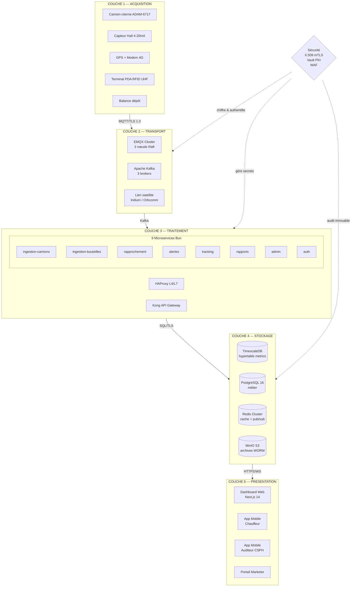

#### Flux 1 (Gaz vrac) vs Flux 2 (Bouteilles 50 kg)

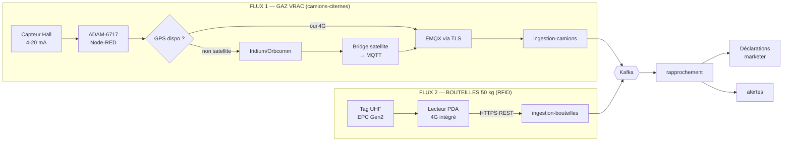

```
┌─────────────────────────────────────────────────────────────────────────────┐
│                        COUCHE TERRAIN (Field Layer)                          │
├─────────────────────────────────────────────────────────────────────────────┤
│                                                                              │
│  ┌──────────────────────────────┐      ┌──────────────────────────────┐   │
│  │  FLUX 1 — Camions-citernes   │      │  FLUX 2 — Bouteilles 50 kg   │   │
│  │                              │      │                              │   │
│  │  • Capteur Hall (4-20mA)     │      │  • Tags RFID UHF (EPC Gen2) │   │
│  │  • GPS intégré               │      │  • Terminal PDA 4G          │   │
│  │  • ADAM-6717 (Node-RED)      │      │  • App. mobile (Android)     │   │
│  │  • Teltonika RUT241 (4G)     │      │                              │   │
│  │  • Batterie LiFePO4          │      │                              │   │
│  └──────────────┬───────────────┘      └──────────────┬───────────────┘   │
│                 │                                      │                   │
└─────────────────┼──────────────────────────────────────┼───────────────────┘
                  │ MQTT/TLS                            │ HTTPS/4G
                  │ QoS 1-2                             │ REST + JWT
                  ▼                                      ▼
┌─────────────────────────────────────────────────────────────────────────────┐
│                  COUCHE TRANSPORT (Transport Layer)                          │
├─────────────────────────────────────────────────────────────────────────────┤
│                                                                              │
│  ┌────────────────────────────────────────────────────────────────────┐    │
│  │                   MQTT Broker (EMQX Cluster)                       │    │
│  │  • Ports: 8883 (TLS) / 1883 (interne) / 8083 (WebSocket)          │    │
│  │  • Auth: X.509 mTLS pour devices, JWT pour apps                   │    │
│  │  • ACL: isolation par truck_id / pda_device_id                    │    │
│  │  • HA: 3 nœuds minimum, clustering natif                          │    │
│  └────────────────────────────┬───────────────────────────────────────┘    │
│                               │                                            │
│  ┌────────────────────────────┴───────────────────────────────────────┐    │
│  │              API Gateway (Kong / Nginx + custom)                  │    │
│  │  • Load balancing (round-robin / least-connections)              │    │
│  │  • Rate limiting (1000 req/min/device, 100 req/min/user)        │    │
│  │  • SSL termination                                               │    │
│  │  • Request validation & transformation                           │    │
│  └────────────────────────────┬───────────────────────────────────────┘    │
│                               │                                            │
└───────────────────────────────┼────────────────────────────────────────────┘
                                │
                                ▼
┌─────────────────────────────────────────────────────────────────────────────┐
│                 COUCHE TRAITEMENT (Processing Layer)                         │
├─────────────────────────────────────────────────────────────────────────────┤
│                                                                              │
│  ┌─────────────────┐  ┌─────────────────┐  ┌─────────────────┐            │
│  │  Service        │  │  Service        │  │  Service        │            │
│  │  Ingestion      │  │  Ingestion      │  │  Ingestion      │            │
│  │  Camions        │  │  RFID Bouteilles│  │  (batch/S&F)    │            │
│  │  (MQTT subs.)   │  │  (REST webhook) │  │  (REST)         │            │
│  └────────┬────────┘  └────────┬────────┘  └────────┬────────┘            │
│           │                    │                    │                      │
│           └────────────────────┼────────────────────┘                      │
│                                ▼                                           │
│  ┌────────────────────────────────────────────────────────────────────┐    │
│  │           Bus d'événements interne (Kafka / Redis Streams)         │    │
│  │  Topics: sensor.ingested, bottle.scanned, alert.generated         │    │
│  └────────┬───────────────────────────────────────────────────┬───────┘    │
│           ▼                                                       ▼        │
│  ┌─────────────────┐                                    ┌──────────────┐   │
│  │  Moteur de       │                                    │  Service     │   │
│  │  rapprochement   │                                    │  Alertes     │   │
│  │  & détection     │                                    │  (multi-     │   │
│  │  d'anomalies     │                                    │  canaux)     │   │
│  └────────┬────────┘                                    └──────┬───────┘   │
│           │                                                    │            │
└───────────┼────────────────────────────────────────────────────┼────────────┘
            │                                                    │
            ▼                                                    ▼
┌─────────────────────────────────────────────────────────────────────────────┐
│                   COUCHE DONNÉES (Data Layer)                               │
├─────────────────────────────────────────────────────────────────────────────┤
│                                                                              │
│  ┌────────────────────┐  ┌────────────────────┐  ┌────────────────────┐  │
│  │  Time-Series DB    │  │  Base relationnelle│  │  Cache distribué   │  │
│  │  (TimescaleDB)     │  │  (PostgreSQL 16)   │  │  (Redis 7)         │  │
│  │                    │  │                    │  │                    │  │
│  │  • positions       │  │  • trucks          │  │  • sessions        │  │
│  │  • sensor_readings │  │  • bottles         │  │  • hot data        │  │
│  │  • metrics         │  │  • deliveries      │  │  • rate limits     │  │
│  │  • alerts_history  │  │  • marketers       │  │  • pub/sub         │  │
│  │  (hypertables,     │  │  • users           │  │                    │  │
│  │   compression)     │  │  • audit_logs      │  │                    │  │
│  │                    │  │  (read replicas)   │  │                    │  │
│  └─────────┬──────────┘  └─────────┬──────────┘  └──────────┬─────────┘  │
│            │                       │                         │            │
└────────────┼───────────────────────┼─────────────────────────┼────────────┘
             │                       │                         │
             └───────────────────────┴─────────────────────────┘
                                     │
                                     ▼
┌─────────────────────────────────────────────────────────────────────────────┐
│                  COUCHE PRÉSENTATION (Presentation Layer)                   │
├─────────────────────────────────────────────────────────────────────────────┤
│                                                                              │
│  ┌────────────────────────────────────────────────────────────────────┐    │
│  │  Dashboard CSPH (React + Next.js + TypeScript)                     │    │
│  │  • Carte temps réel (Leaflet / Mapbox)                            │    │
│  │  • KPI cards (camions actifs, alertes, livraisons)               │    │
│  │  • Graphiques (Chart.js / Recharts)                              │    │
│  │  • Tableaux d'alertes avec acquittement                          │    │
│  │  • Rapports de péréquation exportables (PDF/Excel)              │    │
│  │  • Module d'administration (utilisateurs, camions, marketers)   │    │
│  └────────────────────────────────────────────────────────────────────┘    │
│                                                                              │
│  ┌────────────────────────────────────────────────────────────────────┐    │
│  │  Application Mobile Chauffeur (React Native)                      │    │
│  │  • Statut de la mission en cours                                  │    │
│  │  • Scan RFID manuel (fallback)                                   │    │
│  │  • Déclaration d'incidents                                       │    │
│  └────────────────────────────────────────────────────────────────────┘    │
│                                                                              │
└─────────────────────────────────────────────────────────────────────────────┘
```

### 13.2 Principes directeurs

L'architecture suit cinq principes fondateurs qui guident l'ensemble des décisions techniques.

#### 13.2.1 Scalabilité horizontale

**Justification :** Le système doit absorber la croissance progressive du parc (500 → 5000+ camions) sans refonte majeure.

**Application concrète :**
- **Stateless services** : aucune donnée de session dans les processus applicatifs
- **Auto-scaling** : Kubernetes HPA sur métriques CPU/RAM/queue depth
- **Partitionnement données** : TimescaleDB chunking par mois, PostgreSQL partitioning sur `truck_id` hashé
- **Sharding MQTT** : EMQX permet le clustering horizontal par ajout de nœuds

**Avantages :**
- Montée en charge linéaire
- Coût proportionnel à l'usage
- Résilience aux pics (heures de pointe, fin de mois)

**Inconvénients / Mitigations :**
- Complexité opérationnelle accrue → monitoring centralisé (Prometheus + Grafana)
- Cohérence éventuelle entre shards → eventual consistency acceptée pour les données non-critiques

#### 13.2.2 Résilience et tolérance aux pannes

**Justification :** Une interruption du service signifierait une perte de visibilité sur le gaz subventionné — impact financier direct pour l'État.

**Application concrète :**

| Couche | Mécanisme de résilience |
|--------|-------------------------|
| Terrain (camions) | Buffer offline 72h sur ADAM-6717 (carte micro-SD) |
| Terrain (PDA) | SQLite local + sync différée |
| Transport (MQTT) | Cluster EMQX 3 nœuds (quorum Raft) |
| Traitement | Retry exponentiel, dead-letter queues |
| Données | Réplication PostgreSQL (1 primary + 2 replicas), TimescaleDB HA |
| Présentation | CDN, multi-AZ deployment |

**Objectifs SLA :**
- Disponibilité plateforme : **> 99,5 %** (4h38 d'indisponibilité/an max)
- RPO (Recovery Point Objective) : **≤ 5 minutes** (perte de données max)
- RTO (Recovery Time Objective) : **≤ 30 minutes** (temps de reprise)

#### 13.2.3 Sécurité défense en profondeur

**Justification :** Les données de transport de matières dangereuses (ADR) sont sensibles. Toute compromission aurait des conséquences graves (fraude, sécurité publique).

**Application concrète — modèle "Zero Trust" :**
- **Transport** : TLS 1.3 obligatoire partout (devices ↔ broker, clients ↔ API, services ↔ DB)
- **Authentification** : certificats X.509 pour les devices IoT, JWT pour les utilisateurs
- **Autorisation** : RBAC granulaire + ABAC pour les règles contextuelles
- **Chiffrement au repos** : AES-256 sur les volumes de stockage, TDE PostgreSQL
- **Segmentation réseau** : VLAN isolés, security groups stricts
- **Audit trail** : toutes les actions critiques journalisées de manière immuable

**Avantages :**
- Conformité réglementaire (CEMAC, ADR, RGPD pour données personnelles)
- Détection précoce des compromissions
- Limitation de l'impact en cas d'intrusion

**Inconvénients :**
- Complexité de gestion des certificats → PKI dédiée avec rotation automatique
- Latence additionnelle (5-15ms) → négligeable à l'échelle du système

#### 13.2.4 Observabilité by design

**Justification :** Un système de supervision national doit être lui-même supervisé.

**Application concrète — les trois piliers :**
- **Métriques** : Prometheus + Grafana (dashboards par service)
- **Logs** : stack ELK (Elasticsearch, Logstash, Kibana) avec centralisation
- **Traces** : OpenTelemetry pour le tracing distribué (Jaeger)

Métriques clés exposées :
- Throughput MQTT (messages/s)
- Latence p95/p99 des requêtes API
- Profondeur des queues Kafka
- Utilisation CPU/RAM/disk de chaque service
- Taux d'erreur par endpoint
- Délai d'ingestion (capteur → base)

#### 13.2.5 Idempotence et résilience applicative

**Justification :** Le réseau 4G/LTE au Cameroun est parfois instable (zones blanches). Le système doit accepter les doublons et les réémissions sans corrompre l'état.

**Application concrète :**
- **Idempotency keys** sur les endpoints POST (header `Idempotency-Key`)
- **Dédoublonnage** côté serveur par `(truck_id, sequence_number)`
- **Stock & Forward** : la gateway embarquée rejoue les trames manquées à la reconnexion
- **Transactions optimistes** avec numéro de version

### 13.3 Justification des choix technologiques

| Composant | Choix retenu | Alternatives écartées | Justification |
|-----------|--------------|------------------------|---------------|
| **Langage backend principal** | **Go (Golang)** | Java/Spring, Node.js, Python | Go offre le meilleur compromis performance/concurrence pour de l'IoT haut-débit. Compilation statique (binaire léger), goroutines adaptées aux I/O asynchrones (MQTT, DB), écosystème mature (EMQX client, pgx, gRPC). Java/Spring plus lourd à déployer. Python insuffisant en perf. Node.js single-thread problématique. |
| **API Gateway** | **Kong** | Nginx, HAProxy, Traefik | Kong est nativement API-centric (plugins OAuth, rate-limit, logging). Nginx excellent en proxy L4/L7 mais nécessite du développement custom pour les fonctions API. Traefik plus orienté Kubernetes mais moins riche. |
| **Message Broker (bus interne)** | **Apache Kafka** | RabbitMQ, Redis Streams, NATS | Kafka est le standard pour le streaming à haut débit avec rétention longue. 500 camions × 1 msg/30s + événements dérivés = besoin de buffering et relecture. RabbitMQ plus simple mais limité en throughput. Redis Streams limité en persistance. |
| **Time-Series DB** | **TimescaleDB** | InfluxDB, QuestDB, Prometheus | TimescaleDB est une extension PostgreSQL — bénéfice de la standardisation SQL, jointures possibles avec la base métier, hypertables avec compression automatique 90%+. InfluxDB excellent en TSDB pure mais silo. QuestDB immature. Prometheus orienté métriques, pas événements. |
| **Base relationnelle** | **PostgreSQL 16** | MySQL, MariaDB, Oracle | PostgreSQL est le SGBD open-source le plus avancé : support JSON/JSONB, partitioning natif, réplication logique, extensions (PostGIS pour géolocalisation). Écosystème et compétences largement disponibles au Cameroun. |
| **Cache & sessions** | **Redis 7** | Memcached, KeyDB | Redis polyvalent (cache, pub/sub, streams, sessions). Persistance RDB+AOF, structures riches (hash, sorted set pour leaderboards, geospatial). Memcached limité à du cache simple. |
| **Container orchestration** | **Kubernetes (K8s)** | Docker Swarm, Nomad | K8s est le standard industriel, écosystème pléthorique (Helm, Operators), auto-healing, service mesh (Istio/Linkerd). Nécessite une équipe formée — mitigated par KaaS managé (EKS, GKE, AKS). |
| **Frontend Dashboard** | **React + Next.js + TypeScript** | Vue.js, Angular, Svelte | React a l'écosystème le plus riche pour les dashboards complexes (cartes, graphiques temps réel). Next.js apporte SSR/SSG, TypeScript la sécurité de typage. Cartes : Leaflet (open-source) ou Mapbox. |
| **MQTT Broker** | **EMQX** | HiveMQ, Mosquitto | EMQX est le broker MQTT open-source le plus performant (10M+ connexions, clustering natif, dashboard intégré). HiveMQ Enterprise excellent mais propriétaire. Mosquitto limité en scalabilité. Voir section 14. |

---

## 14. Broker de messages (MQTT)

### 14.1 Solution retenue : EMQX

**EMQX** (version 5.x) est retenu comme broker MQTT central pour les raisons suivantes :

#### Avantages EMQX

| Critère | Évaluation | Commentaire |
|---------|------------|-------------|
| **Performance** | ★★★★★ | 10M+ connexions concurrentes sur un cluster 5 nœuds. Throughput 1M+ msg/s. |
| **Clustering natif** | ★★★★★ | Mnesia distribuée, découverte automatique via `ekka`, réplication des sessions. |
| **Protocoles** | ★★★★★ | MQTT 3.1.1 / 5.0, WebSocket, MQTT-SN, CoAP, LwM2M. |
| **Authentification** | ★★★★★ | Plugins : mTLS, JWT, PSK, LDAP, MySQL, PostgreSQL, HTTP custom. |
| **ACL dynamiques** | ★★★★★ | Réactualisation à chaud, support des règles complexes. |
| **Persistance** | ★★★★☆ | Backend RocksDB ou PostgreSQL, configurable. |
| **Monitoring** | ★★★★★ | Dashboard intégré, export Prometheus, OpenTelemetry. |
| **Communauté** | ★★★★☆ | Écosystème actif, version entreprise disponible. |
| **Coût** | ★★★★★ | Open-source (Apache 2.0), version Enterprise optionnelle. |

#### Alternatives évaluées

| Broker | Avantages | Inconvénients | Verdict |
|--------|-----------|---------------|---------|
| **HiveMQ** | Très mature, support commercial, extensions riches | Propriétaire, coût licence élevé (~10k€/an par nœud) | ❌ Budget prohibitif à l'échelle nationale |
| **Mosquitto** | Léger, simple, parfait pour edge | Pas de clustering natif, limité à ~100K connexions | ❌ Insuffisant pour 500-5000 camions |
| **VerneMQ** | Clustering, Open-source, compatible MQTT 5.0 | Communauté plus petite, documentation moindre | ❌ Moins battle-tested qu'EMQX |
| **AWS IoT Core** | Managed, intégration cloud native | Vendor lock-in, coût par message, dépendance réseau AWS | ❌ Souhait de souveraineté cloud |

#### Justification finale EMQX

EMQX coche toutes les cases :
1. **Souveraineté technique** : open-source, déployable on-premise ou cloud souverain
2. **Scalabilité prouvée** : utilisé par des opérateurs télécom majeurs (Vodafone, China Mobile)
3. **Sécurité enterprise-ready** : mTLS, RBAC, audit log
4. **Coût maîtrisé** : pas de licence, support communautaire + version entreprise si besoin

### 14.2 Configuration des topics & ACL

#### 14.2.1 Hiérarchie des topics

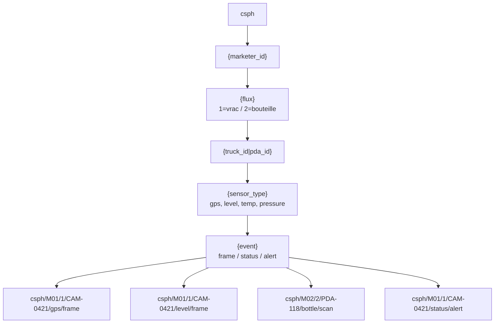

```
cspH/
├── {truck_id}/
│   ├── sensors/
│   │   ├── level              (QoS 1, retained=false)
│   │   ├── temperature        (QoS 1, retained=false)
│   │   ├── pressure           (QoS 1, retained=false)
│   │   └── aggregate          (QoS 1, retained=false)
│   ├── gps/
│   │   └── position           (QoS 1, retained=false)
│   ├── status/
│   │   ├── heartbeat          (QoS 1, retained=true)  ← last-will
│   │   └── connectivity       (QoS 1, retained=true)
│   ├── alerts/
│   │   ├── critical           (QoS 2, retained=false)  ← leak, tamper
│   │   └── warning            (QoS 1, retained=false)
│   ├── commands/
│   │   └── config             (QoS 2, retained=true)   ← OTA config
│   └── store-forward/
│       └── batch              (QoS 1, retained=false)  ← replay
│
├── pda/
│   ├── {pda_device_id}/
│   │   ├── bottle/
│   │   │   ├── scanned        (QoS 1, retained=false)
│   │   │   └── delivery       (QoS 1, retained=false)
│   │   └── status/
│   │       └── heartbeat      (QoS 1, retained=true)
│
├── system/
│   ├── alerts/
│   │   └── broadcast          (QoS 1, retained=false)  ← admin only
│   ├── devices/
│   │   └── online             (QoS 1, retained=true)   ← presence
│   └── config/
│       └── update             (QoS 2, retained=true)   ← config push
│
└── cspH/                      (réservé, sous-domaine CSPH)
    ├── audit/
    └── reports/
```

#### 14.2.2 Règles ACL (Access Control List)

Les ACL sont définies par **device** (certificat X.509) et par **utilisateur** (JWT). Format EMQX :

```erlang
%% Camion TRK-001 peut publier sur ses propres topics
{allow, {username, "device:truck_trk-001"}, all, ["cspH/TRK-001/#"]}.

%% Camion TRK-001 NE PEUT PAS s'abonner aux topics des autres
{deny, {username, "device:truck_trk-001"}, subscribe, ["cspH/+/sensors/#"]}.
{deny, {username, "device:truck_trk-001"}, subscribe, ["cspH/+/gps/#"]}.

%% PDA PDA-CMR-001 peut publier sur ses topics
{allow, {username, "device:pda_pda-cmr-001"}, all, ["cspH/pda/PDA-CMR-001/#"]}.

%% Service d'ingestion backend : lecture de tous les topics + admin
{allow, {username, "service:ingestion"}, subscribe, ["cspH/#"]}.

%% Service alertes : peut publier sur system/alerts
{allow, {username, "service:alerts"}, publish, ["cspH/system/alerts/#"]}.

%% Admin CSPH : tout
{allow, {username, "role:admin"}, all, ["cspH/#"]}.

%% Dispatcher : lecture trucks uniquement, pas d'écriture
{allow, {username, "role:dispatcher"}, subscribe, ["cspH/+/gps/#", "cspH/+/status/#", "cspH/+/alerts/#"]}.
```

#### 14.2.3 Retention & Last Will Testament (LWT)

```yaml
# Last Will : à la déconnexion inattendue, le broker publie
last_will:
  topic: "cspH/{truck_id}/status/connectivity"
  payload: "offline"
  qos: 1
  retain: true

# Topic retained pour état actuel
retained_topics:
  - "cspH/+/status/heartbeat"     # last seen
  - "cspH/+/status/connectivity"  # online/offline
  - "cspH/system/devices/online"  # liste présence
```

### 14.3 Haute disponibilité & clustering

#### 14.3.1 Architecture du cluster EMQX

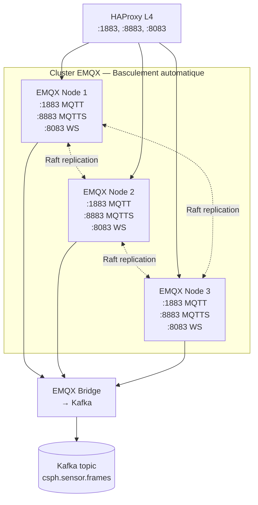

```
┌─────────────────────────────────────────────────────────────┐
│                   EMQX CLUSTER (3 NODES)                     │
│                                                              │
│  ┌────────────────┐  ┌────────────────┐  ┌────────────────┐│
│  │   EMQX Node 1  │  │   EMQX Node 2  │  │   EMQX Node 3  ││
│  │   (Leader)     │◄─┤   (Replica)    │◄─┤   (Replica)    ││
│  │   Region A     │  │   Region A     │  │   Region A     ││
│  │   VIP-A        │  │   VIP-B        │  │   VIP-C        ││
│  └────────┬───────┘  └────────┬───────┘  └────────┬───────┘│
│           │                   │                   │        │
│           └───────────────────┴───────────────────┘        │
│                     Gossip (Ekka)                           │
│                                                              │
└─────────────────────────────────────────────────────────────┘
            │                              │
            │ MQTT/8883 (TLS)              │ HTTP API (8081)
            │                              │
            ▼                              ▼
    ┌────────────────┐              ┌────────────────┐
    │  IoT Devices   │              │  Monitoring    │
    │  (500+ trucks) │              │  (Prometheus)  │
    └────────────────┘              └────────────────┘
```

**Configuration minimale :** 3 nœuds (quorum Raft) pour tolérer la perte d'1 nœud sans interruption.

#### 14.3.2 Stratégies de résilience

| Scénario | Mécanisme | Temps de reprise |
|----------|-----------|------------------|
| Panne d'un nœud EMQX | Reconnexion automatique des clients vers les nœuds survivants | < 5 secondes |
| Perte réseau d'un nœud | Sessions persistées via Mnesia, re-synchronisation | < 30 secondes |
| Saturation d'un nœud | Load balancer redirige vers les nœuds moins chargés | < 1 seconde |
| Perte du cluster entier | Failover vers cluster secondaire (DR) | < 5 minutes |

#### 14.3.3 Persistance

Deux backends de persistance configurables selon criticité :

**PostgreSQL** (recommandé pour audit et replay) :
```yaml
mqtt:
  durable_sessions: true
  durable_queues: true
  
backend:
  type: postgresql
  database: "emqx"
  host: "postgres-primary.internal"
  username: "emqx"
  password: "${EMQX_DB_PASSWORD}"
  pool_size: 32
```

**RocksDB** (pour les messages à haut débit sans besoin relationnel) :
```yaml
backend:
  type: rockdb
  data_dir: "/var/lib/emqx/rocksdb"
```

#### 14.3.4 Monitoring du broker

Métriques Prometheus exposées par EMQX :

```promql
# Connexions actives
emqx_connections_count{node="emqx@10.0.1.1"}

# Messages par seconde
rate(emqx_messaging_received_total[1m])

# Latence publish
emqx_messaging_publish_latency_seconds{quantile="0.99"}

# Sessions durables
emqx_sessions_durable_count
```

Alertes configurées :
- Connexions > 80% capacité → avertissement
- Latence p99 > 200ms → investigation
- Nœud en erreur → basculement

---

## 15. Backend & traitement des données

### 15.1 Architecture des services

L'architecture backend suit le pattern **microservices événementiels** avec un bus Kafka central.

#### 15.1.1 Principes

- **Service autonome** : chaque service possède sa propre base de données (Database per Service)
- **Communication asynchrone** : Kafka pour les événements métier, gRPC/REST pour les appels synchrones
- **Stateless** : aucune session dans le process, état externalisé en DB ou Redis
- **12-Factor App** : configuration par variables d'environnement, logs structurés, dépendances déclarées

#### 15.1.2 Catalogue des services

| Service | Responsabilité | Entrée | Sortie |
|---------|----------------|--------|--------|
| **ingestion-camions** | Réception MQTT des trames camions, validation, normalisation | MQTT (8883) | Kafka topic `sensor.ingested` |
| **ingestion-bouteilles** | Réception REST des scans RFID depuis les PDA | REST (`/v1/deliveries`) | Kafka topic `bottle.scanned` |
| **ingestion-batch** | Réception des lots store & forward | REST (`/v1/ingest/batch`) | Kafka topic `sensor.ingested.batch` |
| **rapprochement** | Croisement volumes déclarés / mesurés, détection d'anomalies | Kafka topics | Kafka `alert.generated` |
| **alertes** | Évaluation règles, notification multi-canal | Kafka `alert.generated` | WebSocket, SMS, Email, Push |
| **tracking** | Diffusion temps réel des positions via WebSocket | Kafka + DB | WebSocket clients |
| **rapports** | Génération de rapports périodiques de péréquation | Cron | PDF/Excel stockés |
| **admin** | CRUD entités métier (camions, marketers, utilisateurs) | REST | PostgreSQL |
| **auth** | Authentification et gestion des sessions utilisateurs | REST | JWT émis |

#### 15.1.3 Diagramme d'interaction

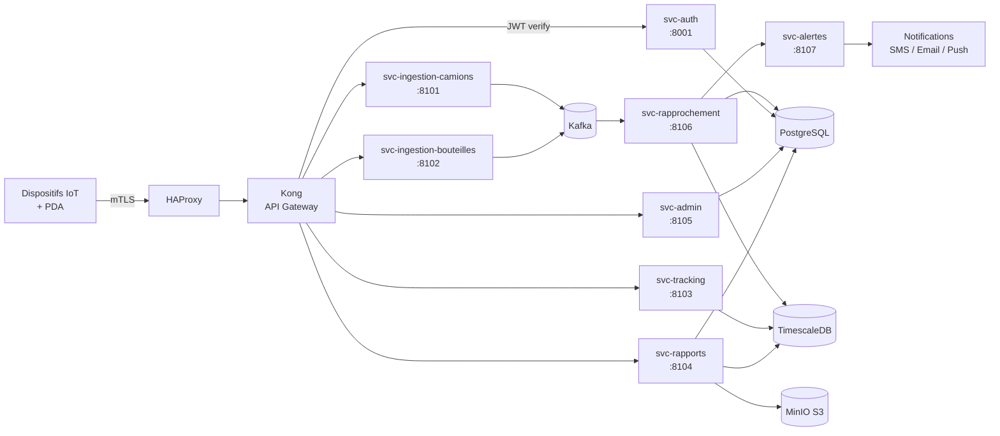

#### Bus Kafka — Topologie & topics

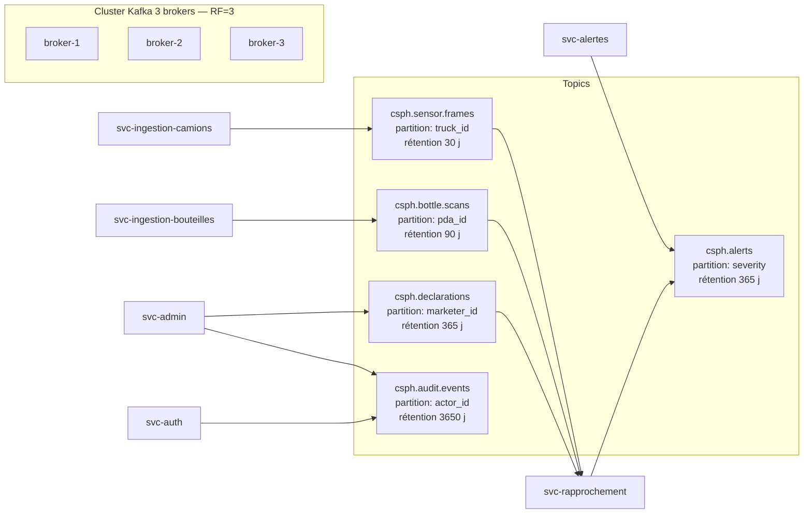

```
                        ┌──────────────────┐
                        │  IoT Devices     │
                        │  (Camions/PDA)   │
                        └────────┬─────────┘
                                 │ MQTT / REST
                                 ▼
┌─────────────────────────────────────────────────────────┐
│                  EMQX Broker / API Gateway               │
└────────────────────────┬────────────────────────────────┘
                         │
        ┌────────────────┼────────────────┐
        │                │                │
        ▼                ▼                ▼
┌──────────────┐  ┌──────────────┐  ┌──────────────┐
│  ingestion-  │  │  ingestion-  │  │  ingestion-  │
│  camions     │  │  bouteilles  │  │  batch       │
└──────┬───────┘  └──────┬───────┘  └──────┬───────┘
       │                 │                 │
       └─────────────────┼─────────────────┘
                         │
                         ▼
              ┌──────────────────────┐
              │   Apache Kafka Bus   │
              │  (Internal Events)   │
              └──────────┬───────────┘
                         │
        ┌────────────────┼────────────────┐
        │                │                │
        ▼                ▼                ▼
┌──────────────┐  ┌──────────────┐  ┌──────────────┐
│ rapprochement│  │   tracking   │  │   alertes    │
└──────┬───────┘  └──────┬───────┘  └──────┬───────┘
       │                 │                 │
       └─────────────────┼─────────────────┘
                         │
        ┌────────────────┼────────────────┐
        ▼                ▼                ▼
   TimescaleDB      PostgreSQL         Redis
   (positions)      (métier)          (cache/sessions)
```

### 15.2 API Gateway

#### 15.2.1 Choix technologique : Kong

**Kong** (version 3.x) est retenu pour les raisons suivantes :

| Critère | Kong | Nginx | HAProxy | Traefik |
|---------|------|-------|---------|---------|
| Plugins API (auth, rate-limit) | ★★★★★ | ★★ | ★ | ★★★ |
| Performance (RPS) | ~30K | ~50K | ~100K | ~20K |
| Support OpenAPI | ★★★★★ | ★★ | ★ | ★★★ |
| Dashboard UI | ★★★★ | ★★ | ★ | ★★★ |
| Service mesh | ★★★★ | ★ | ★ | ★★★ |
| Courbe d'apprentissage | ★★★ | ★★★★ | ★★★ | ★★★★ |

Kong est préféré pour sa **richesse fonctionnelle API-native** : OAuth2, rate-limiting granulaire, transformation de requêtes, monitoring intégré.

#### 15.2.2 Configuration Kong

```yaml
# kong.yml
services:
  - name: ingestion-camions
    url: http://ingestion-camions:8080
    routes:
      - name: ingest-mqtt-bridge
        paths:
          - /v1/ingest
    plugins:
      - name: rate-limiting
        config:
          minute: 1000
          hour: 30000
          policy: redis
          redis_host: redis://redis.internal:6379
      - name: jwt
        config:
          key_claim_name: kid
          secret_is_base64: false
      
  - name: tracking
    url: http://tracking:8080
    routes:
      - name: tracking-rest
        paths:
          - /v1/tracking
      - name: tracking-ws
        paths:
          - /v1/tracking/stream
        protocols:
          - ws
    plugins:
      - name: cors
        config:
          origins: ["https://dashboard.ciph.cm"]
      - name: websocket-size-limit
        config:
          max_payload_size: 256KB
```

#### 15.2.3 Sécurité de l'API Gateway

- **SSL/TLS termination** : seul Kong expose le port 443 public
- **Backend mTLS** : Kong authentifie les services internes par certificats
- **WAF (Web Application Firewall)** : plugin `bot-detection` + `acl` sur IP autorisées
- **JWT validation** : vérification signature + claims (iss, aud, exp, nbf)
- **CORS strict** : origines explicitement whitelistées

### 15.3 Services métier

#### 15.3.1 Service d'ingestion des données des camions

**Responsabilité :** Recevoir les trames MQTT des camions, les valider, les normaliser, les publier sur Kafka.

**Implémentation (Go) :**

```go
// Service principal
type IngestionCamionsService struct {
    mqttClient    mqtt.Client
    kafkaProducer kafka.Producer
    validator     *Validator
    sequenceDb    *SequenceTracker
}

func (s *IngestionCamionsService) Start(ctx context.Context) error {
    // Souscrire aux topics camions
    topics := []string{
        "cspH/+/sensors/+",
        "cspH/+/gps/+",
        "cspH/+/status/+",
    }
    
    if token := s.mqttClient.SubscribeMultiple(filters, s.onMessage); token.Wait() && token.Error() != nil {
        return token.Error()
    }
    return nil
}

func (s *IngestionCamionsService) onMessage(_ mqtt.Client, msg mqtt.Message) {
    // 1. Décoder la trame
    var frame models.SensorFrame
    if err := json.Unmarshal(msg.Payload(), &frame); err != nil {
        metrics.IngestionErrors.WithLabelValues("parse").Inc()
        return
    }
    
    // 2. Valider
    if err := s.validator.Validate(frame); err != nil {
        metrics.IngestionErrors.WithLabelValues("validation").Inc()
        return
    }
    
    // 3. Vérifier la séquence (anti-rejeu)
    if !s.sequenceDb.IsNewSequence(frame.TruckID, frame.Sequence) {
        return // Doublon ignoré
    }
    
    // 4. Normaliser (enrichir timestamps UTC, ajouter serveur-side)
    normalized := s.normalize(frame)
    
    // 5. Publier sur Kafka
    s.kafkaProducer.Send(&kafka.Message{
        Topic: "sensor.ingested",
        Key:   []byte(frame.TruckID),
        Value: normalized.ToJSON(),
    })
    
    metrics.IngestionSuccess.Inc()
}
```

**Validation effectuée :**

| Champ | Règle de validation |
|-------|---------------------|
| `truck_id` | Format `TRK-XXX`, existe en base |
| `timestamp` | ISO 8601 UTC, pas dans le futur, pas trop ancien (< 5 min) |
| `position.lat/lng` | Bornes Cameroun, pas (0,0) |
| `sensors.level` | 0-100%, taux de variation < 10%/min |
| `sensors.temperature` | -40°C à +70°C |
| `sensors.pressure` | 0-20 bar |
| `sequence` | Entier croissant unique par truck_id |

#### 15.3.2 Service d'ingestion RFID bouteilles

**Responsabilité :** Recevoir les scans RFID depuis les terminaux PDA (REST), valider les EPC, enregistrer les livraisons.

**Endpoint :** `POST /v1/deliveries`

```go
type DeliveryRequest struct {
    PDA_DeviceID  string       `json:"pda_device_id" validate:"required"`
    DriverID      string       `json:"driver_id" validate:"required"`
    ClientID      string       `json:"client_id" validate:"required"`
    DepotID       string       `json:"depot_id" validate:"required"`
    DeliveryType  string       `json:"delivery_type" validate:"required,oneof=delivery return"`
    Bottles       []BottleScan `json:"bottles" validate:"required,min=1,max=100,dive"`
    Position      GeoPoint     `json:"position"`
    Timestamp     time.Time    `json:"timestamp" validate:"required"`
    IdempotencyKey string       `json:"-"` // header
}

type BottleScan struct {
    RFID_EPC     string `json:"rfid_epc" validate:"required,len=24"`
    SerialNumber string `json:"serial_number" validate:"required"`
    Status       string `json:"status" validate:"required,oneof=filled empty damaged"`
}
```

**Validation EPC :**

```go
func validateEPC(epc string) error {
    // Format EPC Gen2 : 24 caractères hexadécimaux (96 bits)
    if len(epc) != 24 {
        return errors.New("EPC must be 24 hex chars")
    }
    if _, err := hex.DecodeString(epc); err != nil {
        return errors.New("EPC must be valid hex")
    }
    // Préfixe CSPH (notre OID) : E2003411
    if !strings.HasPrefix(epc, "E2003411") {
        return errors.New("EPC does not belong to CSPH")
    }
    return nil
}
```

**Idempotence :**

```go
func (s *Service) HandleDelivery(req DeliveryRequest) error {
    // Vérifier si déjà traité (idempotence)
    if existing := s.idempotencyStore.Get(req.IdempotencyKey); existing != nil {
        return existing // Retourner le résultat précédent
    }
    
    // Traiter
    delivery := s.processDelivery(req)
    
    // Stocker pour idempotence (TTL 24h)
    s.idempotencyStore.Set(req.IdempotencyKey, delivery, 24*time.Hour)
    
    return delivery
}
```

#### 15.3.3 Moteur de rapprochement & détection d'anomalies

**Responsabilité :** Croiser les données de terrain avec les déclarations marketers, détecter les écarts significatifs, générer les alertes.

**Sources de données :**

| Source | Données | Fréquence |
|--------|---------|-----------|
| Camions (IoT) | Volumes chargés, livrés, positions | Continue |
| Bouteilles (RFID) | Identité bouteille, destinataire, position | Par livraison |
| Marketers (déclaratif) | Bons de livraison papier, déclarations mensuelles | Mensuelle |
| CSPH (référentiel) | Prix subvention, quotas, marketers agréés | Référentiel |

**Règles de détection implémentées :**

```python
# Règle 1 : Écart de volume anormal
def detect_volume_discrepancy(truck_id, period):
    measured = get_measured_volume(truck_id, period)
    declared = get_declared_volume(truck_id, period)
    
    if declared == 0:
        return Alert("MISSING_DECLARATION", "critical", 
                     f"Aucune déclaration pour {truck_id}")
    
    ratio = measured / declared
    if ratio < 0.85:  # Plus de 15% de sous-déclaration
        return Alert("VOLUME_DISCREPANCY", "critical",
                     f"Sous-déclaration de {(1-ratio)*100:.1f}%",
                     measured=measured, declared=declared)
    return None

# Règle 2 : Détection de fuite
def detect_leak(truck_id, recent_pressure_readings):
    drop_rate = calculate_drop_rate(recent_pressure_readings)
    if drop_rate > 2.0:  # bar/min
        return Alert("GAS_LEAK", "critical",
                     f"Chute de pression anormale: {drop_rate:.2f} bar/min",
                     truck_id=truck_id, position=last_position)
    return None

# Règle 3 : Bouteille non retournée
def detect_unreturned_bottle(serial_number):
    last_delivery = get_last_delivery(serial_number)
    if last_delivery and days_since(last_delivery.date) > 60:
        return Alert("BOTTLE_OVERDUE", "warning",
                     f"Bouteille {serial_number} non retournée depuis 60+ jours")
    return None

# Règle 4 : Déviation de route
def detect_route_deviation(truck_id, planned_route, current_position):
    deviation = distance_to_route(current_position, planned_route)
    if deviation > 500:  # mètres
        return Alert("ROUTE_DEVIATION", "warning",
                     f"Déviation de {deviation:.0f}m de la route prévue",
                     truck_id=truck_id)
    return None

# Règle 5 : Bouteille inconnue (fraude potentielle)
def detect_unknown_bottle(rfid_epc):
    bottle = lookup_bottle_by_epc(rfid_epc)
    if bottle is None:
        return Alert("UNKNOWN_BOTTLE", "critical",
                     f"Tag RFID non enregistré: {rfid_epc}",
                     possible_fraud=True)
    return None
```

**Architecture du moteur :**

```
┌──────────────────────────────────────────────────────────────┐
│            Service Rapprochement (Python/Spark)              │
│                                                               │
│  ┌────────────────────────────────────────────────────────┐  │
│  │              Consommateur Kafka                        │  │
│  │  Topics: sensor.ingested, bottle.scanned,              │  │
│  │          marketer.declaration, system.config           │  │
│  └────────────────────┬───────────────────────────────────┘  │
│                       │                                       │
│                       ▼                                       │
│  ┌────────────────────────────────────────────────────────┐  │
│  │           Moteur de règles (Drools / Custom)           │  │
│  │  - VolumeDiscrepancyRule                              │  │
│  │  - LeakDetectionRule                                   │  │
│  │  - UnreturnedBottleRule                                │  │
│  │  - RouteDeviationRule                                  │  │
│  │  - UnknownBottleRule                                   │  │
│  │  - SubsidyEligibilityRule                              │  │
│  └────────────────────┬───────────────────────────────────┘  │
│                       │                                       │
│                       ▼                                       │
│  ┌────────────────────────────────────────────────────────┐  │
│  │           Enrichissement & Corrélation                │  │
│  │  Jointures temps réel entre flux IoT et référentiel   │  │
│  └────────────────────┬───────────────────────────────────┘  │
│                       │                                       │
│                       ▼                                       │
│  Kafka topic "alert.generated"                                │
└──────────────────────────────────────────────────────────────┘
```

#### 15.3.4 Service d'alertes

**Responsabilité :** Réception des alertes depuis Kafka, routage multi-canal, gestion de l'acquittement.

**Canaux de notification :**

| Sévérité | Canal principal | Canaux secondaires |
|----------|-----------------|---------------------|
| Critical (fuite, tamper, fraude) | SMS + Push mobile + Dashboard | Email + Webhook |
| Warning (déviation, retard) | Dashboard + Email | Push mobile |
| Info (geofence, livraison) | Dashboard | - |

**Implémentation :**

```go
type AlertService struct {
    kafkaConsumer  kafka.Consumer
    smsProvider    sms.Provider
    emailProvider  email.Provider
    pushProvider   push.Provider
    wsHub          *websocket.Hub
    alertRepo      *repositories.AlertRepository
    userRepo       *repositories.UserRepository
}

func (s *AlertService) HandleAlert(ctx context.Context, alert models.Alert) error {
    // 1. Persister
    if err := s.alertRepo.Create(alert); err != nil {
        return err
    }
    
    // 2. Déterminer les destinataires
    recipients := s.resolveRecipients(alert)
    
    // 3. Router selon sévérité
    switch alert.Severity {
    case "critical":
        // SMS immédiat à l'astreinte
        go s.smsProvider.Send(recipients.OnCall, alert)
        // Push à tous les admins
        go s.pushProvider.Send(recipients.Admins, alert)
        // Email de backup
        go s.emailProvider.Send(recipients.OnCall, alert)
        // Diffusion WebSocket temps réel
        s.wsHub.BroadcastAlert(alert)
    case "warning":
        s.wsHub.BroadcastAlert(alert)
        go s.emailProvider.Send(recipients.Dispatchers, alert)
    case "info":
        s.wsHub.BroadcastAlert(alert)
    }
    
    return nil
}
```

### 15.4 Load Balancing

#### 15.4.1 Stratégie retenue

**Stratégie : Least Connections + Health Checks**

| Critère | Choix | Justification |
|---------|-------|---------------|
| Algorithme | **Least Connections** | Répartit la charge selon la charge réelle (vs round-robin) |
| Persistance | **Source IP hash** (sticky) | MQTT et WebSocket nécessitent des sessions longues |
| Health checks | **Actifs (HTTP + MQTT)** | Détection précoce des backends HS |
| Failover | **Automatique < 5s** | Quorum EMQX + Kubernetes readiness probes |
| Drainage | **Graceful shutdown 30s** | Permet de finir les requêtes en cours |

#### 15.4.2 Outil : HAProxy

**HAProxy** est retenu comme load balancer pour les raisons suivantes :

| Critère | HAProxy | Nginx | Envoy | Cloud LB (ALB) |
|---------|---------|-------|-------|----------------|
| L4 (TCP) | ★★★★★ | ★★★★ | ★★★★★ | ★★★★ |
| L7 (HTTP) | ★★★★★ | ★★★★★ | ★★★★★ | ★★★★ |
| WebSocket | ★★★★ | ★★★★ | ★★★★★ | ★★★ |
| Performance | ★★★★★ | ★★★★ | ★★★★★ | ★★★★★ |
| Configuration | ★★★★ | ★★★★ | ★★★ | ★★★★★ |
| Souveraineté | ★★★★★ | ★★★★★ | ★★★★★ | ★ |
| Coût | Gratuit | Gratuit | Gratuit | Payant |

**Configuration HAProxy :**

```haproxy
global
    maxconn 50000
    log /dev/log local0
    
defaults
    mode http
    log global
    option httplog
    option dontlognull
    timeout connect 5s
    timeout client  50s
    timeout server  50s

frontend ft_mqtt_tls
    bind *:8883 ssl crt /etc/haproxy/certs/cspH.pem
    mode tcp
    default_backend bk_emqx

backend bk_emqx
    mode tcp
    balance leastconn
    stick-table type ip size 50k expire 30m
    stick on src
    option tcp-check
    tcp-check connect port 1883
    server emqx-1 10.0.1.10:1883 check inter 5s
    server emqx-2 10.0.1.11:1883 check inter 5s
    server emqx-3 10.0.1.12:1883 check inter 5s

frontend ft_api
    bind *:443 ssl crt /etc/haproxy/certs/cspH.pem
    default_backend bk_kong

backend bk_kong
    balance leastconn
    option httpchk GET /v1/health
    http-check expect status 200
    server kong-1 10.0.2.10:8000 check inter 5s
    server kong-2 10.0.2.11:8000 check inter 5s
    server kong-3 10.0.2.12:8000 check inter 5s

frontend ft_ws
    bind *:8443 ssl crt /etc/haproxy/certs/cspH.pem
    default_backend bk_tracking

backend bk_tracking
    balance source
    option httpchk GET /v1/health
    server tracking-1 10.0.3.10:8080 check inter 5s
    server tracking-2 10.0.3.11:8080 check inter 5s
```

### 15.5 Performance & Concurrence (Bun-tuned)

> **Diagramme associé :** [architecture-cloud.eraser](../diagrams/eraser/architecture-cloud.eraser) (vue d'ensemble)
>
> **ADR lié :** [ADR-0001 — Adopter Bun comme runtime backend](../adr/0001-use-bun-runtime.md)

Le backend CSPH est implémenté en **Bun 1.x** (TypeScript natif) plutôt qu'en Go ou Node.js, conformément à l'ADR-0001. Cette section justifie l'atteinte du SLA 99,5 % avec un runtime mono-thread event-loop.

#### 15.5.1 Modèle de concurrence

| Charge | Bun event-loop | Bun + workers | Go goroutines | Node.js |
|--------|---------------|---------------|---------------|---------|
| I/O concurrent (10k connexions) | ✅ ~80k req/s | ✅ ~120k req/s | ✅ ~100k req/s | ✅ ~50k req/s |
| CPU-bound (crypto X.509) | ⚠️ bloque loop | ✅ via worker | ✅ natif | ⚠️ bloque loop |
| Démarrage à froid | ✅ < 50 ms | ✅ < 60 ms | ✅ < 30 ms | ⚠️ ~500 ms |
| Mémoire (10k connexions idle) | ~150 MB | ~250 MB | ~80 MB | ~400 MB |

**Décision architecturale** : event-loop Bun pour tout l'I/O (HTTP REST, MQTT, WebSocket, Kafka, PostgreSQL), **worker pool** pour les opérations CPU-bound.

#### 15.5.2 Pattern d'implémentation par service

```
┌────────────────────────────────────────────────────────────┐
│                  Pattern Microservice Bun                   │
├────────────────────────────────────────────────────────────┤
│                                                             │
│  Edge (HAProxy) ──TLS──► Bun.serve() [Controller]          │
│                              │                              │
│                              ▼                              │
│                   Worker Pool (N=4 par service)            │
│                              │                              │
│              ┌───────────────┼───────────────┐             │
│              ▼               ▼               ▼             │
│         parse+verify    X.509 decrypt   anomaly score     │
│              │               │               │             │
│              └───────────────┼───────────────┘             │
│                              ▼                              │
│                    Kafka producer (batched)                │
│                              │                              │
│                              ▼                              │
│                  Postgres / Timescale writer               │
│                                                             │
└────────────────────────────────────────────────────────────┘
```

#### 15.5.3 Cibles de performance

| Métrique | Cible | Justification |
|----------|-------|---------------|
| Débit par service (pics) | 50 000 req/s | 17 msg/s × 500 camions × marge 50× |
| Latence p50 | < 5 ms | Sous le seuil d'invisibilité utilisateur |
| Latence p99 | < 50 ms | SLA perceptible (web) |
| Latence p99.9 | < 200 ms | Marge pour pics réseau 4G |
| Mémoire par pod | < 512 MB | Tenant K8s standard |
| CPU par pod | < 500 m | Event-loop non bloquant |
| Cold start | < 1 s | Workers Bun préchauffés |
| Connexions MQTT simultanées | 5000+ | 500 camions × 10 sessions |

#### 15.5.4 Benchmarks de référence (à mesurer en phase 0)

| Test | Outil | Cible | Statut |
|------|-------|-------|--------|
| Throughput HTTP | `wrk -t4 -c100 -d30s` | > 50k req/s | À mesurer |
| Latence p99 | `wrk --latency` | < 50ms | À mesurer |
| Throughput MQTT | `emqtt_bench` | > 5k msg/s | À mesurer |
| Charge Kafka producer | `kafka-producer-perf-test` | > 10k msg/s | À mesurer |
| Charge Postgres | `pgbench` | > 5k TPS | À mesurer |
| Charge 24h | `k6 cloud` | p99 < 50ms stable | À mesurer |
| Mémoire sous charge | `prometheus` RSS | < 512 MB/pod | À mesurer |
| Cold start | `kubectl rollout` | < 1s | À mesurer |

#### 15.5.5 Mitigations pour le risque SLA

| Risque | Mitigation |
|--------|------------|
| Event-loop bloqué par CPU | Worker pool dédié pour crypto X.509, JSON parse lourd, scoring ML |
| Fuite mémoire | Tests mémoire en CI (long-run soak tests), profiling continu |
| Cold start trop long | Snapshot Bun préchauffé, K8s `startupProbe` ajusté |
| Packages npm incompatibles | Liste autorisée, tests d'intégration systématiques |
| Régression perf entre releases | Benchmarks automatisés en CI, alerte si régression > 10% |
| Single point of failure | 3 réplicas min par service, auto-restart K8s, circuit breakers |

#### 15.5.6 Stack d'observabilité intégrée

| Couche | Outil | Métriques clés |
|--------|-------|----------------|
| Tracing distribué | OpenTelemetry + Jaeger | Latence inter-services |
| Métriques | Prometheus + Grafana | RPS, p99, error rate, CPU, RAM |
| Logs | Loki + Promtail | Erreurs, warnings, audit |
| Profiling | Pyroscope (continuous) | Flame graphs CPU/mémoire |
| SLO tracking | Sloth + Prometheus | Error budget burn rate |

#### 15.5.7 Migration future vers Go (si SLA non tenu)

Plan de repli documenté : si après 6 mois en production le SLA 99,5 % n'est pas atteint, le service `ingestion-camions` (hot path) sera réécrit en Go, les autres services restant en Bun. Cette décision sera tracée via un nouvel ADR.

---

## 16. Bases de données

### 16.1 Base time-series pour les données capteurs

**Solution retenue : TimescaleDB**

#### Partitionnement TimescaleDB (hypertable)

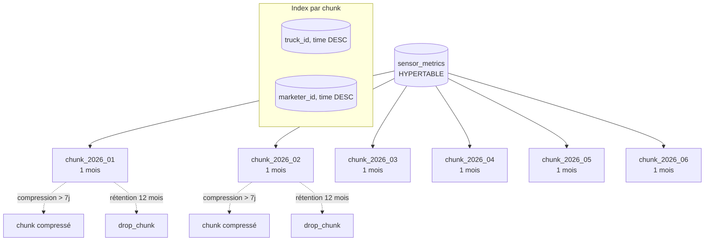

#### 16.1.1 Justification du choix

| Critère | TimescaleDB | InfluxDB | QuestDB | Prometheus |
|---------|-------------|----------|---------|------------|
| Langage requête | SQL standard | InfluxQL / Flux | SQL | PromQL |
| Compression | ★★★★★ (90%+) | ★★★ | ★★★★ | ★★★ |
| Rétention configurable | ★★★★★ | ★★★★ | ★★★ | ★★ |
| Jointures SQL | ★★★★★ | ★★ | ★★★★ | ✗ |
| Écosystème/outillage | ★★★★★ (PG) | ★★★ | ★★ | ★★★ |
| Performance insertion | ★★★★ | ★★★★★ | ★★★★★ | ★★★★ |
| Coût opérationnel | ★★★★ (PG connu) | ★★★ | ★★ | ★★★★ |

**TimescaleDB est retenu** car :
1. **Extension PostgreSQL** : compétences et outillage existants (psql, pg_dump, pgAdmin)
2. **Hypertable** : partitionnement automatique temporel, performant
3. **Compression native** : 90%+ de gain de stockage
4. **Continuous aggregates** : vues matérialisées rafraîchies automatiquement
5. **Jointures** : croisement possible avec données métier PostgreSQL

#### 16.1.2 Schéma des tables time-series

```sql
-- Extension TimescaleDB
CREATE EXTENSION IF NOT EXISTS timescaledb;

-- Table hypertable des positions
CREATE TABLE positions (
    time        TIMESTAMPTZ NOT NULL,
    truck_id    VARCHAR(20) NOT NULL,
    lat         DOUBLE PRECISION NOT NULL,
    lng         DOUBLE PRECISION NOT NULL,
    altitude    REAL,
    speed       REAL,
    heading     SMALLINT,
    satellites  SMALLINT,
    hdop        REAL,
    fix_quality VARCHAR(10),
    source      VARCHAR(20)  -- 'mqtt', 'gps', 'replay'
);

SELECT create_hypertable('positions', 'time',
    chunk_time_interval => INTERVAL '1 day');

-- Index composites pour les requêtes fréquentes
CREATE INDEX idx_positions_truck_time ON positions (truck_id, time DESC);
CREATE INDEX idx_positions_location ON positions USING GIST (ll_to_earth(lat, lng));

-- Politique de compression (après 7 jours)
ALTER TABLE positions SET (
    timescaledb.compress,
    timescaledb.compress_segmentby = 'truck_id',
    timescaledb.compress_orderby = 'time DESC'
);
SELECT add_compression_policy('positions', INTERVAL '7 days');

-- Politique de rétention (12 mois réglementaires)
SELECT add_retention_policy('positions', INTERVAL '12 months');

-- Table hypertable des lectures capteurs
CREATE TABLE sensor_readings (
    time          TIMESTAMPTZ NOT NULL,
    truck_id      VARCHAR(20) NOT NULL,
    sensor_name   VARCHAR(50) NOT NULL,  -- level, temperature, pressure
    value         DOUBLE PRECISION NOT NULL,
    unit          VARCHAR(10),
    quality       SMALLINT DEFAULT 100  -- 0-100, score de confiance
);

SELECT create_hypertable('sensor_readings', 'time',
    chunk_time_interval => INTERVAL '1 day');

CREATE INDEX idx_sensor_truck_name_time ON sensor_readings (truck_id, sensor_name, time DESC);

ALTER TABLE sensor_readings SET (
    timescaledb.compress,
    timescaledb.compress_segmentby = 'truck_id, sensor_name',
    timescaledb.compress_orderby = 'time DESC'
);
SELECT add_compression_policy('sensor_readings', INTERVAL '7 days');
SELECT add_retention_policy('sensor_readings', INTERVAL '12 months');

-- Agrégat continu : position moyenne par heure par camion
CREATE MATERIALIZED VIEW positions_hourly
WITH (timescaledb.continuous) AS
SELECT
    time_bucket('1 hour', time) AS bucket,
    truck_id,
    AVG(lat) AS avg_lat,
    AVG(lng) AS avg_lng,
    MAX(speed) AS max_speed,
    COUNT(*) AS sample_count
FROM positions
GROUP BY bucket, truck_id;

SELECT add_continuous_aggregate_policy('positions_hourly',
    start_offset => INTERVAL '1 month',
    end_offset => INTERVAL '1 hour',
    schedule_interval => INTERVAL '1 hour');
```

#### 16.1.3 Performances attendues

| Métrique | Valeur |
|----------|--------|
| Ingestion (inserts/s) | 50 000 (5 instances Kafka connect) |
| Latence insertion p99 | < 50 ms |
| Requête plage temporelle (1 jour, 1 truck) | < 200 ms |
| Requête géographique (bbox 10 km) | < 500 ms |
| Stockage 1 an (500 camions) | ~150 Go (avec compression) |

### 16.2 Base relationnelle pour les entités métier

**Solution retenue : PostgreSQL 16**

#### 16.2.1 Schéma détaillé

```sql
-- ================================================================
-- RÉFÉRENTIELS MÉTIER
-- ================================================================

CREATE TABLE marketers (
    id              UUID PRIMARY KEY DEFAULT gen_random_uuid(),
    code            VARCHAR(20) UNIQUE NOT NULL,
    name            VARCHAR(200) NOT NULL,
    license_number  VARCHAR(50) UNIQUE NOT NULL,
    address         TEXT,
    contact_email   VARCHAR(200),
    contact_phone   VARCHAR(20),
    status          VARCHAR(20) DEFAULT 'active',  -- active, suspended, revoked
    created_at      TIMESTAMPTZ DEFAULT NOW(),
    updated_at      TIMESTAMPTZ DEFAULT NOW()
);

CREATE TABLE depots (
    id              UUID PRIMARY KEY DEFAULT gen_random_uuid(),
    code            VARCHAR(20) UNIQUE NOT NULL,
    name            VARCHAR(200) NOT NULL,
    marketer_id     UUID REFERENCES marketers(id),
    location        GEOGRAPHY(POINT, 4326) NOT NULL,
    capacity_liters INTEGER,
    address         TEXT,
    created_at      TIMESTAMPTZ DEFAULT NOW()
);

CREATE INDEX idx_depots_location ON depots USING GIST (location);
CREATE INDEX idx_depots_marketer ON depots (marketer_id);

CREATE TABLE users (
    id              UUID PRIMARY KEY DEFAULT gen_random_uuid(),
    username        VARCHAR(50) UNIQUE NOT NULL,
    email           VARCHAR(200) UNIQUE NOT NULL,
    password_hash   VARCHAR(255) NOT NULL,  -- bcrypt
    full_name       VARCHAR(200),
    role            VARCHAR(30) NOT NULL,  -- admin, dispatcher, marketer, driver, cspH_auditor
    marketer_id     UUID REFERENCES marketers(id),  -- si role=marketer
    depot_id        UUID REFERENCES depots(id),      -- si applicable
    phone           VARCHAR(20),
    status          VARCHAR(20) DEFAULT 'active',
    last_login_at   TIMESTAMPTZ,
    created_at      TIMESTAMPTZ DEFAULT NOW(),
    updated_at      TIMESTAMPTZ DEFAULT NOW()
);

CREATE INDEX idx_users_role ON users (role);
CREATE INDEX idx_users_marketer ON users (marketer_id);

-- ================================================================
-- ENTITÉS PHYSIQUES
-- ================================================================

CREATE TABLE trucks (
    id              UUID PRIMARY KEY DEFAULT gen_random_uuid(),
    truck_id        VARCHAR(10) UNIQUE NOT NULL,  -- TRK-001
    plate_number    VARCHAR(20) UNIQUE NOT NULL,
    capacity_liters INTEGER NOT NULL,
    marketer_id     UUID REFERENCES marketers(id),
    home_depot_id   UUID REFERENCES depots(id),
    current_driver_id UUID REFERENCES users(id),
    device_serial   VARCHAR(50) UNIQUE NOT NULL,  -- n° série ADAM-6717
    certificate_id  VARCHAR(100),  -- X.509 fingerprint
    status          VARCHAR(20) DEFAULT 'active',  -- active, inactive, maintenance
    last_seen_at    TIMESTAMPTZ,
    last_lat        DOUBLE PRECISION,
    last_lng        DOUBLE PRECISION,
    created_at      TIMESTAMPTZ DEFAULT NOW(),
    updated_at      TIMESTAMPTZ DEFAULT NOW()
);

CREATE INDEX idx_trucks_marketer ON trucks (marketer_id);
CREATE INDEX idx_trucks_status ON trucks (status);

CREATE TABLE bottles (
    id              UUID PRIMARY KEY DEFAULT gen_random_uuid(),
    serial_number   VARCHAR(30) UNIQUE NOT NULL,  -- GPL-2024-001234
    rfid_epc        VARCHAR(24) UNIQUE NOT NULL,
    capacity_kg     DECIMAL(5,2) DEFAULT 50.00,
    manufacturer    VARCHAR(100),
    manufacture_date DATE,
    last_inspection_date DATE,
    marketer_id     UUID REFERENCES marketers(id),
    current_location_id UUID REFERENCES depots(id),
    status          VARCHAR(20) DEFAULT 'in_depot',  -- in_depot, in_transit, delivered, returned, damaged
    created_at      TIMESTAMPTZ DEFAULT NOW(),
    updated_at      TIMESTAMPTZ DEFAULT NOW()
);

CREATE INDEX idx_bottles_marketer ON bottles (marketer_id);
CREATE INDEX idx_bottles_status ON bottles (status);
CREATE INDEX idx_bottles_rfid ON bottles (rfid_epc);

-- ================================================================
-- OPÉRATIONS MÉTIER
-- ================================================================

CREATE TABLE trips (
    id              UUID PRIMARY KEY DEFAULT gen_random_uuid(),
    truck_id        VARCHAR(10) REFERENCES trucks(truck_id),
    driver_id       UUID REFERENCES users(id),
    start_depot_id  UUID REFERENCES depots(id),
    end_depot_id    UUID REFERENCES depots(id),
    planned_start   TIMESTAMPTZ,
    planned_end     TIMESTAMPTZ,
    actual_start    TIMESTAMPTZ,
    actual_end      TIMESTAMPTZ,
    status          VARCHAR(20) DEFAULT 'planned',  -- planned, in_progress, completed, cancelled
    start_volume_liters DECIMAL(10,2),
    end_volume_liters   DECIMAL(10,2),
    distance_km     DECIMAL(10,2),
    created_at      TIMESTAMPTZ DEFAULT NOW()
);

CREATE INDEX idx_trips_truck ON trips (truck_id);
CREATE INDEX idx_trips_driver ON trips (driver_id);
CREATE INDEX idx_trips_status ON trips (status);

CREATE TABLE deliveries (
    id              UUID PRIMARY KEY DEFAULT gen_random_uuid(),
    trip_id         UUID REFERENCES trips(id),
    truck_id        VARCHAR(10) REFERENCES trucks(truck_id),
    driver_id       UUID REFERENCES users(id),
    client_id       UUID,
    client_name     VARCHAR(200) NOT NULL,
    client_address  TEXT,
    delivery_type   VARCHAR(20) NOT NULL,  -- 'delivery' (bouteilles remplies) ou 'return' (vides)
    bottles_count   INTEGER NOT NULL,
    bottle_ids      UUID[] NOT NULL,
    position        GEOGRAPHY(POINT, 4326),
    pda_device_id   VARCHAR(50),
    volume_loaded_liters  DECIMAL(10,2),
    volume_delivered_liters DECIMAL(10,2),
    status          VARCHAR(20) DEFAULT 'completed',  -- pending, completed, disputed
    delivery_date   TIMESTAMPTZ NOT NULL,
    client_signature_url TEXT,
    created_at      TIMESTAMPTZ DEFAULT NOW()
);

CREATE INDEX idx_deliveries_trip ON deliveries (trip_id);
CREATE INDEX idx_deliveries_truck ON deliveries (truck_id);
CREATE INDEX idx_deliveries_date ON deliveries (delivery_date);
CREATE INDEX idx_deliveries_location ON deliveries USING GIST (position);

CREATE TABLE loading_events (
    id              UUID PRIMARY KEY DEFAULT gen_random_uuid(),
    truck_id        VARCHAR(10) REFERENCES trucks(truck_id),
    depot_id        UUID REFERENCES depots(id),
    operator_id     UUID REFERENCES users(id),
    volume_loaded_liters DECIMAL(10,2) NOT NULL,
    measured_level_percent DECIMAL(5,2),
    measured_level_liters DECIMAL(10,2),
    sensor_match    BOOLEAN,  -- true si volume déclaré = volume mesuré
    discrepancy_pct DECIMAL(5,2),
    loading_start   TIMESTAMPTZ,
    loading_end     TIMESTAMPTZ,
    created_at      TIMESTAMPTZ DEFAULT NOW()
);

CREATE INDEX idx_loading_truck ON loading_events (truck_id);
CREATE INDEX idx_loading_depot ON loading_events (depot_id);

-- ================================================================
-- ALERTES
-- ================================================================

CREATE TABLE alerts (
    id              UUID PRIMARY KEY DEFAULT gen_random_uuid(),
    alert_type      VARCHAR(50) NOT NULL,
    severity        VARCHAR(20) NOT NULL,  -- critical, warning, info
    source          VARCHAR(20) NOT NULL,  -- mqtt, rfid, reconciliation
    truck_id        VARCHAR(10) REFERENCES trucks(truck_id),
    bottle_id       UUID REFERENCES bottles(id),
    delivery_id     UUID REFERENCES deliveries(id),
    marketer_id     UUID REFERENCES marketers(id),
    title           VARCHAR(200) NOT NULL,
    description     TEXT,
    payload         JSONB,  -- données contextuelles
    position        GEOGRAPHY(POINT, 4326),
    acknowledged    BOOLEAN DEFAULT FALSE,
    acknowledged_by UUID REFERENCES users(id),
    acknowledged_at TIMESTAMPTZ,
    ack_note        TEXT,
    created_at      TIMESTAMPTZ DEFAULT NOW()
);

CREATE INDEX idx_alerts_severity ON alerts (severity);
CREATE INDEX idx_alerts_type ON alerts (alert_type);
CREATE INDEX idx_alerts_truck ON alerts (truck_id);
CREATE INDEX idx_alerts_created ON alerts (created_at DESC);
CREATE INDEX idx_alerts_unack ON alerts (acknowledged) WHERE acknowledged = FALSE;

-- ================================================================
-- AUDIT TRAIL
-- ================================================================

CREATE TABLE audit_logs (
    id              BIGSERIAL PRIMARY KEY,
    event_type      VARCHAR(50) NOT NULL,
    entity_type     VARCHAR(50),
    entity_id       UUID,
    user_id         UUID REFERENCES users(id),
    actor_type      VARCHAR(20) NOT NULL,  -- user, system, device
    old_values      JSONB,
    new_values      JSONB,
    ip_address      INET,
    user_agent      TEXT,
    request_id      UUID,
    created_at      TIMESTAMPTZ DEFAULT NOW()
);

CREATE INDEX idx_audit_user ON audit_logs (user_id);
CREATE INDEX idx_audit_entity ON audit_logs (entity_type, entity_id);
CREATE INDEX idx_audit_created ON audit_logs (created_at DESC);

-- Rendre l'audit immuable
CREATE RULE audit_no_update AS ON UPDATE TO audit_logs DO INSTEAD NOTHING;
CREATE RULE audit_no_delete AS ON DELETE TO audit_logs DO INSTEAD NOTHING;

-- ================================================================
-- DÉCLARATIONS MARKETER (péréquation)
-- ================================================================

CREATE TABLE marketer_declarations (
    id              UUID PRIMARY KEY DEFAULT gen_random_uuid(),
    marketer_id     UUID REFERENCES marketers(id),
    period_year     SMALLINT NOT NULL,
    period_month    SMALLINT NOT NULL,
    declared_volume_liters DECIMAL(12,2) NOT NULL,
    measured_volume_liters DECIMAL(12,2),  -- calculé depuis nos données
    discrepancy_liters DECIMAL(12,2),
    discrepancy_pct DECIMAL(5,2),
    delivery_count  INTEGER,
    status          VARCHAR(20) DEFAULT 'pending',  -- pending, validated, disputed
    validated_by    UUID REFERENCES users(id),
    validated_at    TIMESTAMPTZ,
    created_at      TIMESTAMPTZ DEFAULT NOW(),
    UNIQUE(marketer_id, period_year, period_month)
);

CREATE INDEX idx_declarations_period ON marketer_declarations (period_year, period_month);
```

#### 16.2.2 Réplication et haute disponibilité

```
┌─────────────────────────────────────────────────────────────┐
│                PostgreSQL HA Cluster                         │
│                                                              │
│  ┌────────────────┐                                          │
│  │  Primary       │  (Read/Write)                            │
│  │  10.0.10.10    │  Streaming Replication                   │
│  └───┬────────┬───┘                                          │
│      │        │                                              │
│      ▼        ▼                                              │
│  ┌────────┐  ┌────────┐                                     │
│  │Replica│  │Replica│  (Read-only, hot standby)             │
│  │Sync  │  │Async  │                                        │
│  │  1   │  │  2    │                                        │
│  └────────┘  └────────┘                                     │
│                                                              │
│  + WAL archiving continu (archivage local + S3)             │
│  + PITR (Point In Time Recovery)                            │
│  + Patroni/etcd pour auto-failover                          │
│                                                              │
└─────────────────────────────────────────────────────────────┘
```

| Paramètre | Valeur |
|-----------|--------|
| Mode réplication | 1 synchrone + 1 asynchrone |
| Délai réplication synchrone | < 100 ms |
| WAL archiving | Continu vers S3 (rétention 30 jours) |
| Backups base | `pg_basebackup` quotidien, PITR |
| RPO | ≤ 5 minutes |
| RTO | ≤ 15 minutes (bascule auto) |

### 16.3 Cache (Redis) pour sessions & données fréquentes

#### 16.3.1 Cas d'usage

| Cas d'usage | Type Redis | TTL | Volume estimé |
|-------------|-----------|-----|---------------|
| Sessions utilisateurs | Hash | 24h | ~10 000 sessions × 1KB = 10 MB |
| Rate limiting | Sorted set | 1min | Variable |
| Positions temps réel (500 dernières) | Sorted set | 1h | 500 trucks × 100 pos × 200B = 10 MB |
| Cache requêtes dashboard | String (JSON) | 5min | ~100 MB |
| Pub/Sub alertes | Channel | - | Événementiel |
| Leaderboards (top flottes) | Sorted set | 1h | 1 MB |
| Locks distribués | String (NX) | 30s | Variable |

#### 16.3.2 Architecture Redis

```
┌─────────────────────────────────────────────────────────────┐
│                  Redis Cluster (3 masters + 3 replicas)     │
│                                                              │
│  Master 1  ──►  Replica 1A (slot 0-5460)                   │
│  Master 2  ──►  Replica 2A (slot 5461-10922)               │
│  Master 3  ──►  Replica 3A (slot 10923-16383)              │
│                                                              │
│  Sentinel x3 pour auto-failover                             │
│  Persistance: AOF (append-only file) every 1s               │
│  Memory policy: allkeys-lru                                 │
│                                                              │
└─────────────────────────────────────────────────────────────┘
```

#### 16.3.3 Exemples d'utilisation

```go
// Cache des positions temps réel
func (s *TrackingService) UpdatePosition(truckID string, pos Position) {
    key := fmt.Sprintf("truck:%s:positions", truckID)
    s.redis.ZAdd(ctx, key, redis.Z{
        Score:  float64(pos.Timestamp.Unix()),
        Member: pos.ToJSON(),
    })
    // Garder seulement les 500 dernières
    s.redis.ZRemRangeByRank(ctx, key, 0, -501)
    s.redis.Expire(ctx, key, 1*time.Hour)
}

// Rate limiting
func rateLimit(userID string) bool {
    key := fmt.Sprintf("ratelimit:%s:%d", userID, time.Now().Unix()/60)
    count := s.redis.Incr(ctx, key).Val()
    if count == 1 {
        s.redis.Expire(ctx, key, 1*time.Minute)
    }
    return count <= 100 // 100 req/min
}

// Cache requête dashboard
func (s *DashboardService) GetMarketerStats(marketerID, period string) (*Stats, error) {
    cacheKey := fmt.Sprintf("stats:marketer:%s:%s", marketerID, period)
    
    if cached, err := s.redis.Get(ctx, cacheKey).Result(); err == nil {
        var stats Stats
        json.Unmarshal([]byte(cached), &stats)
        return &stats, nil
    }
    
    stats, err := s.computeStatsFromDB(marketerID, period)
    if err == nil {
        data, _ := json.Marshal(stats)
        s.redis.Set(ctx, cacheKey, data, 5*time.Minute)
    }
    return stats, err
}
```

### 16.4 Modèle de données détaillé

Le modèle de données complet (Entity-Relationship Diagram) est documenté ci-dessous.

#### Schéma entités-relations (PostgreSQL métier)

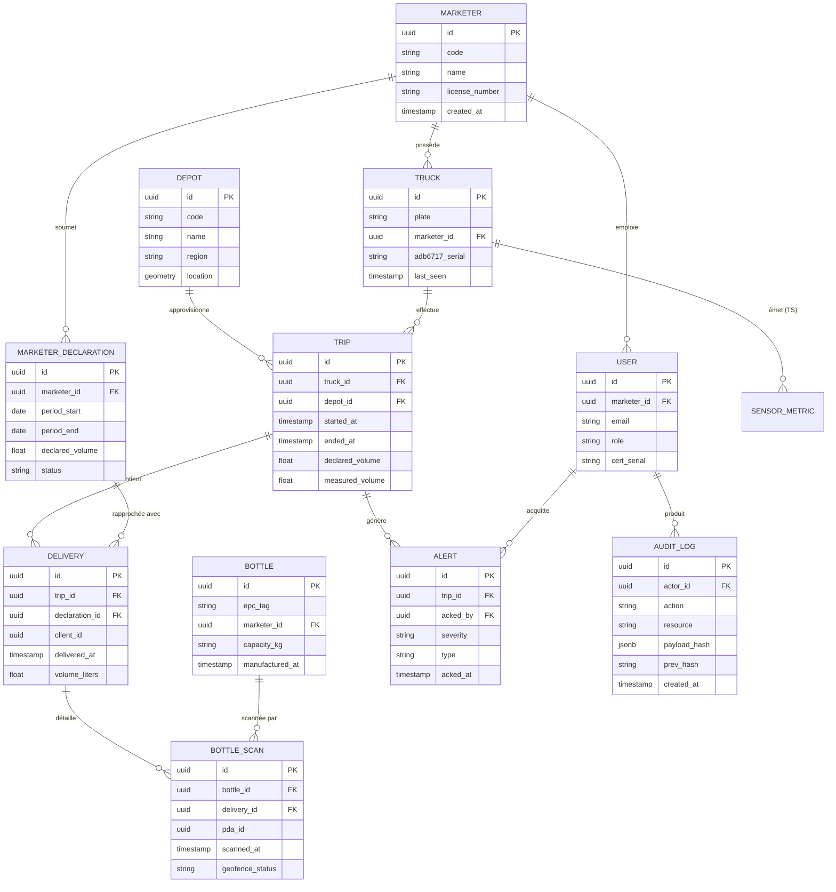

Les cardinalités principales sont :

| Relation | Cardinalité | Description |
|----------|-------------|-------------|
| Marketer → Depots | 1:N | Un marketer exploite plusieurs dépôts |
| Marketer → Trucks | 1:N | Un marketer possède plusieurs camions |
| Marketer → Bottles | 1:N | Bouteilles appartenant à un marketer |
| Depot → Trucks | 1:N → N:M | Un dépôt abrite plusieurs camions (via table d'affectation) |
| Truck → Trips | 1:N | Un camion effectue plusieurs tournées |
| Trip → Deliveries | 1:N | Une tournée contient plusieurs livraisons |
| Delivery → Bottles | N:M | Une livraison concerne N bouteilles (via `bottle_ids`) |
| User → Trips | 1:N (driver) | Un chauffeur conduit plusieurs tournées |
| Truck → Alerts | 1:N | Alertes émises pour un camion |
| Bottle → Alerts | 1:N | Alertes concernant une bouteille |

### 16.5 Réplication & stratégie de sauvegarde

#### 16.5.1 Backups automatisés

| Type | Fréquence | Rétention | Stockage |
|------|-----------|-----------|----------|
| Base PostgreSQL (pg_basebackup complet) | Quotidien 02h00 | 30 jours | S3 + on-premise |
| Base PostgreSQL (WAL archive) | Continu | 30 jours | S3 |
| TimescaleDB (pg_basebackup) | Quotidien 02h30 | 30 jours | S3 |
| Redis (RDB snapshot) | Toutes les 6h | 7 jours | S3 |
| Configurations (Terraform, K8s manifests) | À chaque modification | Illimité (Git) | Git |
| MQTT broker state (sessions) | Continu (si activé) | 7 jours | PostgreSQL |

#### 16.5.2 Tests de restauration

Procédure exécutée **mensuellement** :
1. Restaurer le dernier backup sur environnement de test
2. Vérifier l'intégrité des données (row counts, checksums)
3. Tester la connectivité applicative
4. Mesurer le RTO effectif

#### 16.5.3 Plan de reprise d'activité (PRA)

| Scénario | RTO | RPO | Mécanisme |
|----------|-----|-----|-----------|
| Crash PostgreSQL primaire | < 5 min | < 5s | Failover auto vers replica synchrone (Patroni) |
| Corruption données | < 30 min | < 1h (selon dernière sauvegarde) | PITR depuis WAL archive |
| Perte datacenter entier | < 1h | < 5 min | Failover vers cluster DR (autre zone) |
| Catastrophe (incendie, etc.) | < 4h | < 24h | Restauration depuis backups S3 cross-region |

### 16.6 Backup, Rétention & RPO/RTO

> **Diagramme associé :** [network.eraser](../diagrams/eraser/network.eraser) (VPC DR, flux de réplication)
>
> **Réf. :** §16.5 (réplication), §18.5 (reprise après sinistre)

La rétention **12 mois** des données capteurs et la disponibilité SLA **99,5 %** imposent une stratégie backup et reprise formalisée, avec des RPO/RTO distincts par criticité.

#### 16.6.1 Matrice RPO/RTO

| Composant | Criticité | RPO cible | RTO cible | Mécanisme principal |
|-----------|-----------|-----------|-----------|---------------------|
| **PostgreSQL métier** | Critique (facturation péréquation) | < 5 s | < 5 min | Streaming replication synchrone + Patroni auto-failover |
| **TimescaleDB capteurs** | Critique (preuve fraude) | < 30 s | < 15 min | Streaming replication asynchrone + PITR WAL |
| **Redis cache** | Non-critique (peut être reconstruit) | Aucune (éphémère) | < 5 min | Replica promotion, données perdues acceptables |
| **Kafka topics** | Important (rejeu) | < 1 min | < 30 min | RF=3 + min.insync.replicas=2 |
| **Audit trail (WORM)** | Critique (réglementaire) | 0 (immuable) | < 1 h | Append-only + hash chain + S3 Object Lock |
| **Configurations K8s/IaC** | Important | 0 (Git) | < 10 min | Git = source de vérité, restore trivial |
| **EMQX sessions MQTT** | Secondaire | < 5 min | < 15 min | Store & forward + reconnexion auto |

#### 16.6.2 Stratégie de backup

| Type | Fréquence | Rétention | Cible | Outil |
|------|-----------|-----------|-------|-------|
| **PostgreSQL base backup complet** | Quotidien 02h00 WAT | 30 jours | S3 standard | `pg_basebackup` |
| **PostgreSQL WAL archive** | Continu (streaming) | 30 jours | S3 standard | `archive_command` + `wal-g` |
| **TimescaleDB base backup** | Quotidien 02h30 WAT | 30 jours | S3 standard | `pg_basebackup` |
| **TimescaleDB chunks > 6 mois** | Mensuel | 12 mois | S3 Glacier | `timescaledb.compress` + export |
| **Redis RDB snapshot** | Toutes les 6 h | 7 jours | S3 standard | `BGSAVE` |
| **Kafka topics (mirror)** | Continu (MirrorMaker 2) | 30 jours | Cluster DR | MirrorMaker 2 |
| **MinIO S3 (audit, rapports signés)** | Continu (versioning + WORM) | 12 ans (réglementaire) | S3 Glacier + Object Lock | Native S3 |
| **Config K8s + secrets** | À chaque modification | Illimité | Git + Vault | GitOps (ArgoCD) |
| **Configurations EMQX / Kong** | À chaque modification | Illimité | Git | GitOps |

#### 16.6.3 Procédure de restauration

```bash
# PostgreSQL — PITR (Point-In-Time Recovery)
wal-g backup-fetch /var/lib/postgresql/15/main LATEST
echo "recovery_target_time = '2026-06-01 14:30:00 WAT'" >> postgresql.auto.conf
echo "restore_command = 'wal-g wal-fetch %f %p'" >> postgresql.auto.conf
systemctl start postgresql

# TimescaleDB — idem PostgreSQL + re-create hypertables
psql -c "SELECT create_hypertable('sensor_metrics', 'ts', chunk_time_interval => INTERVAL '1 month')"

# Redis — depuis RDB snapshot
cp /backup/redis/dump.rdb /var/lib/redis/dump.rdb
systemctl start redis

# Kafka — re-créer topics depuis MirrorMaker 2
kafka-topics.sh --create --topic csph.sensor.frames --partitions 12 --replication-factor 3
```

#### 16.6.4 Tests de restauration

| Test | Fréquence | Responsable | KPI |
|------|-----------|-------------|-----|
| PITR PostgreSQL sur environnement test | Mensuel | DBA | Restauration en < 30 min, données cohérentes |
| Failover TimescaleDB | Mensuel | DBA | Promotion replica en < 5 min |
| Reconstruction Redis | Trimestriel | DevOps | Reconstruction depuis RDB < 5 min |
| Basculement Kafka | Trimestriel | DevOps | Perte < 1 min de messages |
| DR complet (autre zone) | Semestriel | Cellule SRE | RTO < 1 h, RPO < 15 min |
| **Game Day (chaos engineering)** | Semestriel | Tous | Tous les scénarios ci-dessus en condition réelle |

#### 16.6.5 Conformité réglementaire

| Exigence | Implémentation | Référence |
|----------|----------------|-----------|
| **Rétention 12 mois** (CSPH) | Politique TimescaleDB `drop_chunks` + S3 Glacier | Cahier des charges CSPH |
| **Rétention audit 12 ans** (CEMAC) | S3 Object Lock en mode Compliance + WORM hash chain | Règlement CEMAC |
| **Immutabilité des preuves** | Hash chain + signature cryptographique + Object Lock | ADR-0001, ADR-0003 |
| **Droit à l'effacement** (si applicable) | Anonymisation sur les données non-réglementaires (RGPD/CEMAC) | Conformité juridique |
| **Localisation des données** (Cameroun) | Tout en S3 région `eu-west-1` (Cameroun non disponible AWS) ou on-premise | Souveraineté numérique |
| **Chiffrement au repos** | AES-256 via S3 SSE + RDS encryption + Vault transit | §18.3 |

#### 16.6.6 Monitoring de la stratégie

Métriques Prometheus à surveiller :

```promql
# Age du dernier backup
time() - backup_last_success_timestamp_seconds{type="pg_basebackup"} < 86400

# WAL archive lag
pg_stat_replication_wal_lag_bytes > 10000000  # > 10 MB

# Taux de succès des tests de restauration (KPI)
restore_test_success_rate_30d > 0.95  # > 95% sur 30 jours
```

Alertes :

| Condition | Sévérité | Notification |
|-----------|----------|--------------|
| Aucun backup PostgreSQL depuis 26 h | 🔴 Critique | On-call DBA + email |
| WAL lag > 100 MB pendant 5 min | 🟠 Warning | Dashboard |
| Test de restauration échoue | 🔴 Critique | On-call DBA + ticket incident |
| Rétention S3 expirant dans 7 jours | 🟢 Info | Email |

---

## 17. Tableau de bord & reporting CSPH

### 17.1 Interface de supervision en temps réel

#### 17.1.1 Architecture frontend

```
┌──────────────────────────────────────────────────────────────┐
│                  Frontend Architecture                         │
│                                                               │
│  ┌─────────────────────────────────────────────────────────┐ │
│  │              Next.js 14 (App Router)                     │ │
│  │                                                          │ │
│  │  • Server Components (SSR pour SEO/initial load)        │ │
│  │  • Client Components (interactivité temps réel)         │ │
│  │  • Server Actions (mutations sécurisées)                │ │
│  │  • Streaming SSR (TTFB optimisé)                       │ │
│  └─────────────────────────────────────────────────────────┘ │
│                            │                                   │
│  ┌─────────────────────────┴───────────────────────────────┐ │
│  │                  State Management                        │ │
│  │  • TanStack Query (cache serveur, invalidation)        │ │
│  │  • Zustand (UI state local)                            │ │
│  │  • WebSocket Context (positions temps réel)            │ │
│  └─────────────────────────────────────────────────────────┘ │
│                            │                                   │
│  ┌─────────────────────────┴───────────────────────────────┐ │
│  │                    UI Library                            │ │
│  │  • shadcn/ui (composants accessibles)                  │ │
│  │  • Tailwind CSS (styling)                              │ │
│  │  • Lucide React (icônes)                               │ │
│  │  • Recharts (graphiques)                               │ │
│  │  • Leaflet + react-leaflet (cartes)                    │ │
│  └─────────────────────────────────────────────────────────┘ │
│                                                               │
└──────────────────────────────────────────────────────────────┘
```

#### 17.1.2 Modules du dashboard

**Module 1 : Vue d'ensemble (Dashboard principal)**

KPI cards en temps réel :
- Camions actifs (moving) / en pause (idle) / hors ligne
- Alertes actives (par sévérité)
- Livraisons aujourd'hui (bouteilles / vrac)
- Chiffre d'affaires du jour (estimé)

Carte temps réel :
- Affichage Leaflet avec tuiles OpenStreetMap (ou Mapbox)
- Marqueurs trucks colorés selon statut
- Clustering à grande échelle (Leaflet.markercluster)
- Polygones geofences (dépôts, zones interdites)
- Trace du trajet sélectionné

Graphiques temps réel :
- Niveau de gaz moyen (courbe 24h)
- Vitesse moyenne par camion
- Répartition statuts (donut)

**Module 2 : Gestion des camions**

Tableau avec :
- Liste paginée (50/page)
- Filtres (marketer, statut, dépôt, recherche)
- Colonnes : ID, plaque, marketer, statut, position, dernière MAJ, niveau
- Actions : détails, historique, désactiver, reprogrammer
- Export CSV/Excel

Vue détail camion :
- Métadonnées (capacité, marqueur, certificat X.509)
- Dernière position + carte
- Graphique niveau 7j
- Liste des alertes récentes
- Historique des tournées
- Liste des livraisons (vrac + bouteilles)

**Module 3 : Gestion des bouteilles**

- Recherche par EPC ou numéro de série
- Vue cycle de vie complet
- Statistiques par marketer

**Module 4 : Alertes**

- Liste temps réel (WebSocket)
- Filtres (sévérité, type, période, acquitté/non)
- Acquisition avec note obligatoire pour critical
- Statistiques de résolution

**Module 5 : Rapports & Analytics**

- Rapports prédéfinis (voir 17.2)
- Générateur de requêtes ad hoc
- Export PDF/Excel/CSV

**Module 6 : Administration**

- Gestion utilisateurs (CRUD + rôles)
- Gestion marketers
- Gestion dépôts
- Gestion camions (enregistrement, certificats)
- Configuration règles d'alerte
- Logs d'audit

#### 17.1.3 Performances attendues

| Métrique | Cible |
|----------|-------|
| First Contentful Paint | < 1,5 s |
| Time to Interactive | < 3 s |
| Carte interactive (500 marqueurs) | 60 FPS |
| Latence WebSocket → MAJ UI | < 100 ms |
| Connexions WebSocket simultanées | 500+ |

### 17.2 Rapports de ventes par marketer

#### 17.2.1 Catalogue de rapports

| Rapport | Description | Fréquence | Format |
|---------|-------------|-----------|--------|
| **Rapport quotidien de livraison** | Liste détaillée des livraisons J-1 par marketer | Quotidien 06h00 | PDF + Excel |
| **Rapport hebdomadaire de performance** | Volumes livrés, taux de service, incidents | Hebdomadaire lundi | PDF |
| **Rapport mensuel de péréquation** | Données officielles pour calcul des compensations | Mensuel J+5 | PDF + Excel signé |
| **Rapport trimestriel d'audit** | Analyse des écarts, fraude potentielle, KPIs | Trimestriel | PDF |
| **Rapport annuel statistique** | Synthèse annuelle pour la CSPH et le MINEE | Annuel | PDF |
| **Rapport d'incident** | Détail d'un incident (fuite, fraude, etc.) | À la demande | PDF |

#### 17.2.2 Génération technique

```python
# Service de génération de rapports (Python)
class ReportService:
    def __init__(self, db, template_engine):
        self.db = db
        self.templates = template_engine
    
    def generate_monthly_perequation(self, year: int, month: int) -> Path:
        """Génère le rapport mensuel officiel de péréquation"""
        
        # 1. Récupérer les données
        declarations = self.db.query("""
            SELECT 
                m.code, m.name,
                md.declared_volume_liters,
                md.measured_volume_liters,
                md.discrepancy_liters,
                md.discrepancy_pct,
                md.delivery_count
            FROM marketer_declarations md
            JOIN marketers m ON m.id = md.marketer_id
            WHERE md.period_year = %s AND md.period_month = %s
        """, year, month)
        
        # 2. Calculer les totaux
        totals = self._compute_totals(declarations)
        
        # 3. Générer le PDF avec Jinja2 + WeasyPrint
        html = self.templates.render('monthly_perequation.html', {
            'year': year, 'month': month,
            'declarations': declarations,
            'totals': totals,
            'generated_at': datetime.now()
        })
        
        # 4. Signer électroniquement
        pdf_path = self._generate_pdf(html)
        signed_path = self._sign_pdf(pdf_path)
        
        return signed_path
```

#### 17.2.3 Modèle de rapport de péréquation

Le rapport mensuel contient :

**Page 1 : Couverture**
- Titre : "Rapport Mensuel de Péréquation GPL"
- Période, date de génération
- Logo CSPH, numéro de rapport

**Page 2 : Synthèse exécutive**
- Nombre de marketers actifs
- Volume total mesuré vs déclaré
- Écart global (%)
- Nombre d'alertes critiques du mois

**Pages 3-N : Détail par marketer**
- Code, nom du marketer
- Volume déclaré (source : déclaration marketer)
- Volume mesuré (source : IoT camions + RFID bouteilles)
- Écart (litres et %)
- Statut (conforme / à vérifier / fraude présumée)
- Actions correctives recommandées

**Dernière page : Annexes**
- Liste des alertes critiques
- Liste des incidents
- Méthodologie et limites

### 17.3 Détection d'écarts & alertes de fraude

#### Pipeline détection de fraude

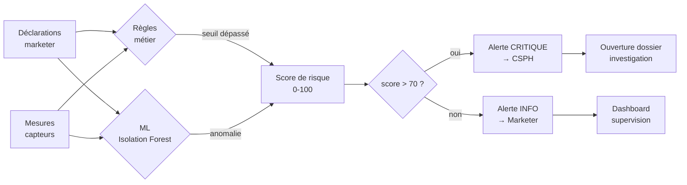

#### 17.3.1 Typologie des fraudes détectées

| Type de fraude | Détection | Sévérité |
|----------------|-----------|----------|
| **Sous-déclaration massive** | Volume mesuré << déclaré sur la période | Critique |
| **Détournement vers usage industriel** | Bouteilles livrées à des clients non-résidentiels alors que déclarées résidentielles | Élevée |
| **Falsification de bons de livraison** | Volume signé ≠ volume réellement livré (corrélation RFID ↔ volume) | Critique |
| **Doublons de scan** | Même bouteille scannée 2+ fois dans la même tournée | Warning |
| **Bouteilles fantômes** | Bouteilles livrées mais non scannées RFID | Élevée |
| **Trajet anormal** | Truck déclaré comme livré à client A, mais à 50km de A | Élevée |
| **Re-routing non autorisé** | Modification de tournée en cours sans autorisation | Warning |
| **Truck offline prolongé** | Pas de données > 1h pendant un trajet planifié | Élevée |

#### 17.3.2 Algorithmes de détection

**Algorithme 1 : Rapprochement déclaratif**

```
Pour chaque (marketer, mois):
  1. Volume_déclaré = somme des bons de livraison papier déclarés
  2. Volume_mesuré = somme des (volume_chargé - volume_restant) par camion
  3. Si |Volume_déclaré - Volume_mesuré| / Volume_déclaré > 15%:
     → ALERTE: Sous-déclaration
  4. Si Volume_déclaré == 0 et livraisons > 0:
     → ALERTE: Absence de déclaration
```

**Algorithme 2 : Détection de bouteilles fantômes**

```
Pour chaque tournée T:
  1. Bottles_chargées = count(bottles scannées au départ du dépôt)
  2. Bottles_livrées = count(bottles scannées chez les clients)
  3. Bottles_retournées_vides = count(bottles scannées en retour)
  4. Si Bottles_chargées != Bottles_livrées + Bottles_retournées_vides:
     → ALERTE: Bouteilles non comptabilisées
```

**Algorithme 3 : Fraude à la péréquation**

```
Pour chaque livraison à un client C:
  1. Type_usage = lookup(C.type_activité)  -- résidentiel, commercial, industriel
  2. Si Type_usage != 'résidentiel':
     → Marquer comme "non éligible subvention"
  3. Compter les livraisons non-éligibles par marketer/mois
  4. Si ratio > 30% pour un marketer:
     → ALERTE: Fraude à la péréquation potentielle
```

**Algorithme 4 : ML Anomaly Detection**

```python
# Modèle Isolation Forest pour détecter les comportements anormaux
from sklearn.ensemble import IsolationForest
import numpy as np

class FraudDetector:
    def __init__(self):
        self.model = IsolationForest(
            n_estimators=100,
            contamination=0.01,  # 1% d'anomalies attendues
            random_state=42
        )
        self.is_trained = False
    
    def train(self, historical_data):
        """Entraîner sur 6+ mois de données historiques"""
        features = self._extract_features(historical_data)
        self.model.fit(features)
        self.is_trained = True
    
    def predict(self, current_data):
        """Prédire si le comportement est anormal"""
        if not self.is_trained:
            return None
        features = self._extract_features(current_data)
        return self.model.predict(features)  # -1 = anomalie, 1 = normal
    
    def _extract_features(self, data):
        """Extraire les features : volumes, vitesse, durée, écarts"""
        return np.array([[
            d.volume_delivered,
            d.volume_loaded,
            d.trip_duration_hours,
            d.distance_km,
            d.avg_speed,
            d.deviation_from_planned_route,
            d.discrepancy_pct
        ] for d in data])
```

### 17.4 Export des statistiques (péréquation, redressements)

#### 17.4.1 Formats d'export

| Format | Usage | Génération |
|--------|-------|------------|
| **PDF signé** | Document officiel transmis aux marketers / MINEE | WeasyPrint + signature PAdES |
| **Excel (XLSX)** | Données brutes pour analyse par les auditeurs | openpyxl |
| **CSV** | Échange avec systèmes tiers (DGI, MINEE) | csv stdlib |
| **JSON** | API pour intégrations | encoding/json |
| **API REST** | Distribution automatisée | Endpoints dédiés |

#### 17.4.2 API d'export

```yaml
# Endpoints d'export
GET /v1/exports/declarations/{year}/{month}?format=pdf|xlsx|csv
GET /v1/exports/alerts?from={date}&to={date}&format=pdf
GET /v1/exports/deliveries?marketer_id={id}&period={period}
GET /v1/exports/perequation/{year}/{month}  # Document officiel signé

# Authentification
Authorization: Bearer <admin_jwt>
X-Export-Signature-Required: true  # Signature numérique obligatoire
```

#### 17.4.3 Signature numérique des documents officiels

```python
from endesive import pdf

def sign_perequation_report(pdf_path, cert_path, key_path):
    """Signe un rapport avec certificat CSPH"""
    
    with open(pdf_path, 'rb') as f:
        data = f.read()
    
    with open(cert_path, 'rb') as f:
        cert = f.read()
    
    with open(key_path, 'rb') as f:
        key = f.read()
    
    # Signature PAdES-BES (PDF Advanced Electronic Signature)
    signed = pdf.cms.sign(
        data,
        None,  # no timestamp
        [
            (cert, key, 'sha256')
        ],
        {},
        'digest',
        'detached'
    )
    
    signed_path = pdf_path.replace('.pdf', '_signed.pdf')
    with open(signed_path, 'wb') as f:
        f.write(signed)
    
    return signed_path
```

### 17.5 Géofencing & zones de livraison

#### Séquence — Livraison Flux 1 (camion-citerne)

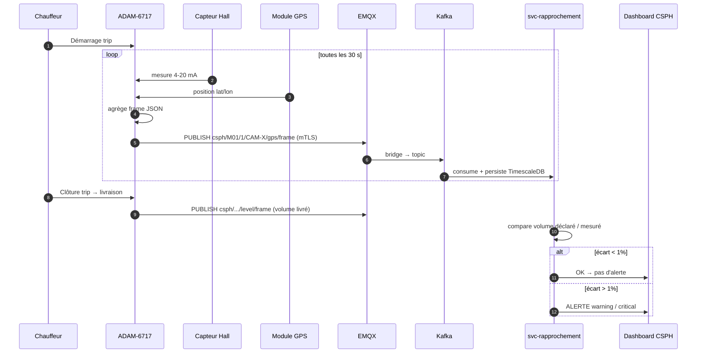

#### Séquence — Livraison Flux 2 (bouteilles RFID)

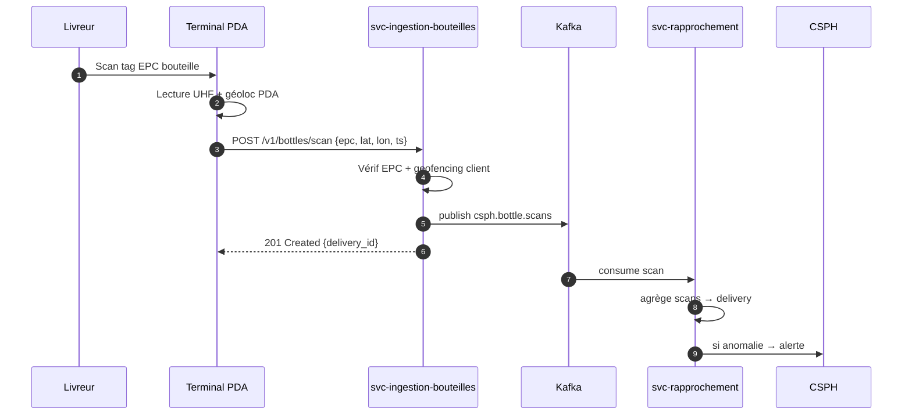

> **Diagramme associé :** [architecture-cloud.eraser](../diagrams/eraser/architecture-cloud.eraser)

Le géofencing permet de **valider automatiquement** qu'une livraison a bien eu lieu dans la zone géographique autorisée du client destinataire, prévenant les fraudes par livraison fictive ou hors zone.

#### 17.5.1 Modèle de données géographiques

**Table `delivery_zones`** (PostgreSQL + PostGIS) :

```sql
CREATE EXTENSION postgis;

CREATE TABLE delivery_zones (
    id UUID PRIMARY KEY DEFAULT gen_random_uuid(),
    client_id UUID NOT NULL REFERENCES clients(id),
    zone_name TEXT NOT NULL,
    zone_type TEXT NOT NULL CHECK (zone_type IN ('polygon', 'circle', 'corridor')),
    geometry GEOMETRY(Geometry, 4326) NOT NULL,  -- WGS84
    buffer_meters INTEGER DEFAULT 50,  -- tolérance GPS
    created_at TIMESTAMPTZ NOT NULL DEFAULT NOW(),
    updated_at TIMESTAMPTZ NOT NULL DEFAULT NOW(),
    is_active BOOLEAN DEFAULT TRUE
);

CREATE INDEX idx_delivery_zones_geometry ON delivery_zones USING GIST (geometry);
CREATE INDEX idx_delivery_zones_client ON delivery_zones(client_id);
```

**Table `geofence_violations`** :

```sql
CREATE TABLE geofence_violations (
    id UUID PRIMARY KEY DEFAULT gen_random_uuid(),
    trip_id UUID NOT NULL REFERENCES trips(id),
    delivery_id UUID REFERENCES deliveries(id),
    event_type TEXT NOT NULL,  -- 'outside_zone', 'buffer_breach', 'impossible_speed'
    expected_zone_id UUID REFERENCES delivery_zones(id),
    actual_position GEOMETRY(Point, 4326),
    distance_meters NUMERIC(10,2),
    severity TEXT NOT NULL CHECK (severity IN ('info', 'warning', 'critical')),
    detected_at TIMESTAMPTZ NOT NULL DEFAULT NOW()
);
```

#### 17.5.2 Validation en temps réel

**Composant** : `svc-tracking` (Bun, validation PostGIS en mémoire)

```typescript
// Validation à chaque frame GPS (toutes les 30 s)
async function validatePosition(
  truckId: string,
  position: { lat: number; lon: number },
  currentTrip: Trip
): Promise<ValidationResult> {
  // 1. Récupérer zones attendues pour ce trip
  const expectedZones = await db.query(`
    SELECT dz.id, dz.zone_name, dz.geometry, dz.buffer_meters
    FROM delivery_zones dz
    JOIN trip_deliveries td ON td.delivery_id = ANY($1)
    JOIN deliveries d ON d.id = td.delivery_id
    WHERE dz.client_id = d.client_id AND dz.is_active = TRUE
  `, [currentTrip.expected_delivery_ids]);

  if (expectedZones.length === 0) {
    return { status: 'ok', reason: 'no_zone_defined' };
  }

  // 2. Vérifier inclusion (PostGIS ST_Contains)
  for (const zone of expectedZones) {
    const isInside = await db.query(`
      SELECT ST_Contains(
        ST_Buffer($1::geometry, $2),
        ST_SetSRID(ST_MakePoint($3, $4), 4326)
      ) AS inside
    `, [zone.geometry, zone.buffer_meters, position.lon, position.lat]);

    if (isInside) {
      return { status: 'ok', zone_id: zone.id, zone_name: zone.zone_name };
    }
  }

  // 3. Hors zone → violation
  const distance = await db.query(`
    SELECT ST_Distance(
      ST_SetSRID(ST_MakePoint($1, $2), 4326)::geography,
      ST_Centroid($3::geometry)::geography
    ) AS dist_meters
  `, [position.lon, position.lat, expectedZones[0].geometry]);

  return {
    status: 'violation',
    distance_meters: distance.rows[0].dist_meters,
    expected_zone: expectedZones[0]
  };
}
```

#### 17.5.3 Algorithme de scoring de risque géospatial

```python
# Détection anomalies de trajectoire (Python service fraud-detection)
def score_trajectory(trip_id: str) -> float:
    """
    Combine 5 signaux pour score 0-100
    - Temps dans zone vs temps total
    - Vitesse incohérente (téléportation)
    - Arrêts non planifiés
    - Distance parcourue vs attendue
    - Pattern répétitif (retour même point)
    """
    points = get_gps_points(trip_id)
    zones = get_expected_zones(trip_id)

    # Temps dans zone
    inside_time = sum(p.duration for p in points if point_in_zone(p, zones))
    ratio = inside_time / total_trip_time
    score_inside = max(0, 100 - ratio * 100)  # 0% inside = 100 pts

    # Téléportation
    teleports = [p for p in points if p.speed_kmh > 200]  # > 200 km/h
    score_teleport = min(100, len(teleports) * 25)

    # Arrêts non planifiés
    unplanned_stops = detect_unplanned_stops(points)
    score_stops = min(100, len(unplanned_stops) * 10)

    # Distance anormale
    actual_dist = compute_path_length(points)
    expected_dist = compute_expected_distance(zones)
    dist_ratio = actual_dist / expected_dist
    score_distance = max(0, min(100, abs(dist_ratio - 1) * 100))

    # Score final pondéré
    return (0.4 * score_inside +
            0.3 * score_teleport +
            0.15 * score_stops +
            0.15 * score_distance)
```

#### 17.5.4 UI de gestion des zones (Dashboard CSPH)

Module `Geofencing Admin` dans le dashboard Next.js :

- **Carte interactive** (Leaflet + tuiles OpenStreetMap Cameroun) : dessin de polygones, cercles, corridors
- **Import / export** GeoJSON (compatible QGIS, Google Earth)
- **Templates** : zones prédéfinies (zone industrielle, dépôt, client VIP)
- **Audit** : historique des modifications de zones (qui, quand, pourquoi)
- **Prévisualisation** : visualisation 3D des zones avec les camions en temps réel
- **Alertes configurables** : par zone, par sévérité, par destinataire

#### 17.5.5 Métriques & alertes

| Métrique | Seuil | Action |
|----------|-------|--------|
| Livraisons hors zone / jour | > 5 | 🟠 Alerte warning |
| Livraisons hors zone / jour | > 20 | 🔴 Alerte critique |
| Temps moyen de détection | < 30 s (4G) / < 5 min (sat) | Info |
| Score trajectoire moyen | > 70 | 🔴 Alerte critique |
| Camion immobile > 6h en dehors dépôt | Oui | 🟠 Alerte warning |

### 17.6 Détection de vol de cargaison

> **Diagramme associé :** [security-zones.eraser](../diagrams/eraser/security-zones.eraser) (zones ATEX + monitoring)

Le vol de cargaison se manifeste typiquement par une **baisse inexpliquée du volume** de la citerne (capteur Hall) sans **livraison déclarée** correspondante. La détection combine plusieurs signaux.

#### 17.6.1 Signaux de détection

| Signal | Source | Seuil | Criticité |
|--------|--------|-------|-----------|
| Δ Volume (Hall) sans livraison | TimescaleDB | Δ > 50 L | 🟠 Warning |
| Δ Volume > 200 L sans livraison | TimescaleDB | Δ > 200 L | 🔴 Critique |
| Δ Volume + arrêt non planifié | Fusion GPS + capteur | Δ > 100 L + stop > 10 min | 🔴 Critique |
| Δ Volume + hors zone | Fusion GPS + geofencing | Δ > 50 L + outside zone | 🔴 Critique |
| Δ Volume + vitesse nulle citerne | Capteur + GPS | Δ > 50 L + speed = 0 | 🟠 Warning |
| Capteur Hall hors plage | Capteur | < 4 mA ou > 20 mA | 🔴 Capteur défaillant |
| Boîtier ouvert | Capteur tamper | Ouverture détectée | 🔴 Critique |
| GPS absent > 1 h | Module GPS | No fix > 3600 s | 🟠 Warning |

#### 17.6.2 Algorithme Isolation Forest (ML)

Modèle ML supervisé pour détecter les patterns anormaux de Δ Volume.

**Features** :

```python
# 18 features temporelles par fenêtre de 30 min
features = [
    'delta_volume_l',          # Δ volume sur la fenêtre
    'delta_volume_rate',       # L/min
    'moving_avg_volume_1h',    # moyenne mobile 1 h
    'std_volume_1h',           # écart-type 1 h
    'is_moving',               # booléen (speed > 5 km/h)
    'time_since_last_delivery',# secondes
    'distance_to_depot',       # km
    'distance_to_client',      # km
    'geofence_status',         # inside/outside/none
    'engine_on',               # booléen
    'door_open',               # booléen (PDA truck)
    'pressure_psi',            # pression citerne
    'temp_celsius',            # température citerne
    'hour_of_day',             # 0-23
    'is_weekend',              # booléen
    'is_night',                # booléen (22h-6h)
    'driver_id',               # catégoriel
    'truck_age_days',          # entier
]
```

**Entraînement** : sur 6 mois d'historique, contamination=0.01 (1% attendu comme anomalie).

**Score** : 0-100, > 70 = alerte critique.

```python
# Service fraud-detection (Python + scikit-learn)
from sklearn.ensemble import IsolationForest
import numpy as np

class CargoTheftDetector:
    def __init__(self, model_path: str):
        self.model = joblib.load(model_path)
        self.scaler = StandardScaler()

    def score_window(self, features: dict) -> dict:
        X = self.scaler.transform([list(features.values())])
        anomaly_score = -self.model.score_samples(X)[0]  # négatif → inversé
        prediction = self.model.predict(X)[0]  # -1 = anomalie

        return {
            'score': float(anomaly_score * 100),
            'is_anomaly': prediction == -1,
            'confidence': float(self.model.decision_function(X)[0])
        }
```

#### 17.6.3 Protocole d'alerte

| Sévérité | Délai de notification | Canaux | Action automatique |
|----------|----------------------|--------|---------------------|
| 🟢 Info (anomalie détectée, score 30-50) | Batch 1 h | Dashboard | Aucune |
| 🟠 Warning (score 50-70) | < 5 min | Email + dashboard | Notification CSPH + marketer |
| 🔴 Critique (score 70+, ou signal fort) | < 30 s | SMS + appel + dashboard | - Gel du truck_id (suspension certifications)<br>- Notification forces de l'ordre (via API dédiée)<br>- Capture des 10 dernières frames<br>- Verrouillage du boîtier à distance (command OTA) |

#### 17.6.4 Investigation post-alerte

Workflow d'investigation humaine :

1. **Confirmation capteur** : vérifier que le Δ volume n'est pas un faux positif (basse température, calibration, etc.)
2. **Corroboration GPS** : la position est-elle cohérente ? (dépot, client, route)
3. **Corroboration chauffeur** : contact du chauffeur, bon de livraison signé
4. **Corroboration client** : le client a-t-il bien reçu le volume annoncé ?
5. **Décision** :
   - OK → marquage faux positif, amélioration du modèle
   - Suspicion → escalade, gel préventif
   - Vol confirmé → procédure judiciaire, dépôt de plainte, désactivation

#### 17.6.5 KPIs

| KPI | Cible | Mesure |
|-----|-------|--------|
| Faux positifs (alertes sans vol réel) | < 5 % | Sur 6 mois glissants |
| Délai de détection (vol réel → alerte) | < 5 min (4G) / < 30 min (sat) | Timestamp capteur → timestamp alerte |
| Précision modèle (F1-score) | > 0.85 | Validation croisée 5-fold |
| Recall (vols détectés) | > 95 % | Audit terrain |

---

## 18. Sécurité du système

### 18.1 Authentification des devices (certificats X.509)

#### 18.1.1 Pourquoi X.509 plutôt que PSK ou mot de passe

| Méthode | Niveau de sécurité | Gestion | Recommandation |
|---------|-------------------|---------|----------------|
| **Mot de passe partagé** | Très faible | Difficile à faire tourner | ❌ À proscrire pour l'IoT |
| **Pre-Shared Key (PSK)** | Moyen | Simple mais une fuite = tout compromis | ⚠️ Acceptable pour des cas simples |
| **Certificat X.509 (mTLS)** | **Élevé** | PKI dédiée, rotation possible | ✅ **Recommandé pour notre cas** |
| **JWT signé** | Élevé | Stateless, mais nécessite un secret partagé | ✅ Bon pour clients web |

**X.509 retenu pour les devices IoT** (camions + PDA) pour :
- **Authentification mutuelle** : le serveur authentifie le device ET inversement
- **Chiffrement natif** : le TLS utilise le certificat pour l'échange de clés
- **Rotation** : révocation + émission de nouveau certificat possible
- **Non-rejeu** : signature empêche la réutilisation
- **Conformité** : standard international pour l'IoT industriel (norme ISO 27001)

#### 18.1.2 Infrastructure PKI

##### Flux PKI X.509 / mTLS

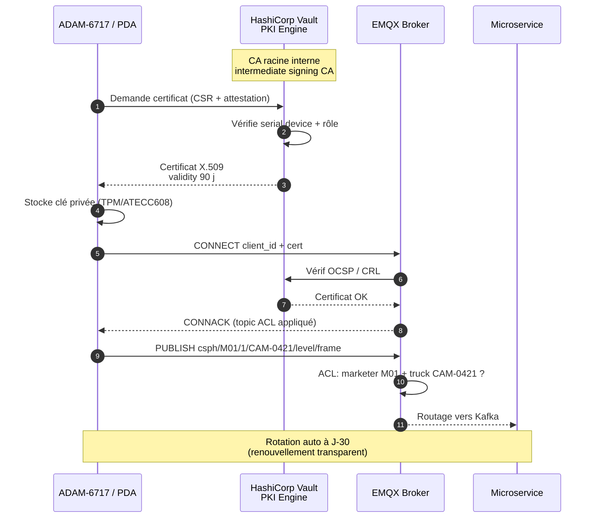

```
┌──────────────────────────────────────────────────────────────┐
│                  PKI Hierarchy                                │
│                                                               │
│              ┌────────────────────┐                          │
│              │  Root CA (offline) │  CSPH Root               │
│              │  20 ans validité   │  Stocké hors-ligne       │
│              └──────────┬─────────┘                          │
│                         │ signe                              │
│                         ▼                                    │
│              ┌────────────────────┐                          │
│              │ Intermediate CA   │  CSPH Issuing             │
│              │ 5 ans validité     │  Online, signe devices   │
│              └──────────┬─────────┘                          │
│                         │ signe                              │
│        ┌────────────────┼────────────────┐                  │
│        ▼                ▼                ▼                  │
│  ┌──────────┐    ┌──────────┐    ┌──────────┐             │
│  │Device    │    │Device    │    │Service   │             │
│  │Cert TRK  │    │Cert PDA  │    │Cert      │             │
│  │2 ans     │    │2 ans     │    │1 an      │             │
│  └──────────┘    └──────────┘    └──────────┘             │
│                                                               │
└──────────────────────────────────────────────────────────────┘
```

**Outils PKI :**
- **EJBCA** (Enterprise Java Beans Certificate Authority) — solution open-source complète
- **Vault PKI Engine** (HashiCorp) — gestion simplifiée, intégré à notre stack
- **Step-ca** (smallstep) — alternative légère

**Choix : Vault PKI Engine** pour :
- Intégration native avec HashiCorp Vault (déjà utilisé pour les secrets)
- API REST pour émission automatique
- CRL (Certificate Revocation List) gérée automatiquement
- Rotation automatique (renew avant expiration)

#### 18.1.3 Format des certificats

**Certificat device (camion) :**

```json
{
  "subject": "CN=truck-trk-001, OU=Devices, O=CSPH, C=CM",
  "issuer": "CN=CSPH Intermediate CA, O=CSPH, C=CM",
  "validity": {
    "not_before": "2026-01-15T00:00:00Z",
    "not_after": "2028-01-15T00:00:00Z"
  },
  "subject_alt_name": {
    "DNS": ["truck-trk-001.ciph.internal"],
    "URI": ["device://truck/TRK-001"],
    "IP": []
  },
  "key_usage": ["digitalSignature", "keyEncipherment"],
  "extended_key_usage": ["clientAuth"],
  "public_key": "RSA 4096 bits",
  "signature_algorithm": "SHA256-RSA"
}
```

**Processus d'émission :**

1. **Provisioning initial** : lors de l'installation sur le camion, l'opérateur saisit le `truck_id`
2. **Génération CSR** : l'ADAM-6717 génère une clé privée + CSR
3. **Envoi à Vault** : CSR transmis via canal sécurisé (HTTPS + auth admin)
4. **Signature** : Vault Intermediate CA signe le certificat
5. **Installation** : certificat + clé stockés dans le secure element de l'ADAM-6717
6. **Activation** : le device se connecte au broker MQTT avec mTLS

#### 18.1.4 Rotation des certificats

| Événement | Action |
|-----------|--------|
| **Routine** | Renouvellement 30 jours avant expiration (automatique) |
| **Compromission suspectée** | Révocation immédiate + nouveau certificat |
| **Device retiré** | Certificat révoqué, ajouté à la CRL |
| **Changement de CA** | Réémission massive planifiée |

**Commande Vault pour rotation :**

```bash
# Vérifier l'expiration
vault read pki_int/cert/truck-trk-001

# Renouveler (renouvelle si < 30 jours)
vault write pki_int/renew/truck-trk-001

# Révoquer (compromission)
vault write pki_int/revoke serial_number=XX:XX:XX
```

### 18.2 Gestion des accès utilisateurs (RBAC)

#### 18.2.1 Modèle RBAC

##### Matrice RBAC — 7 rôles

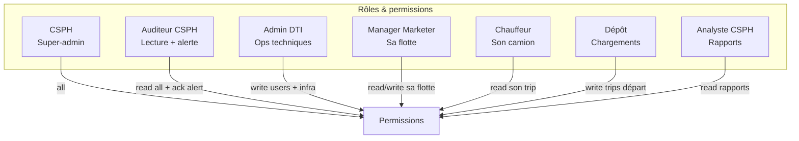

**Rôles définis :**

| Rôle | Description | Permissions |
|------|-------------|-------------|
| `super_admin` | Administrateur technique DTI | Tous les droits techniques, gestion PKI, accès logs |
| `csph_admin` | Administrateur fonctionnel CSPH | Gestion marketers, validation rapports, configuration règles |
| `csph_auditor` | Auditeur CSPH | Lecture seule sur tout, accès rapports détaillés |
| `dispatcher` | Répartiteur en temps réel | Lecture trucks, alertes, acquisitions |
| `marketer_manager` | Responsable marketer | Gestion de ses propres camions et bouteilles |
| `marketer_operator` | Opérateur marketer (saisie) | Saisie déclarations, consultations |
| `driver` | Chauffeur | API mobile limitée (own truck only) |

#### 18.2.2 Matrice de permissions

| Ressource | super_admin | csph_admin | csph_auditor | dispatcher | marketer_mgr | marketer_op | driver |
|-----------|:-----------:|:----------:|:------------:|:----------:|:------------:|:-----------:|:------:|
| **Trucks** | CRUD | R | R | R | R(own) | R(own) | R(own) |
| **Bottles** | CRUD | R | R | R | R(own) | R(own) | - |
| **Deliveries** | CRUD | R | R | R | R(own) | CR(own) | CR(own) |
| **Alerts** | CRUD | R/U | R | R/U | R(own) | R(own) | R(own) |
| **Users** | CRUD | CRUD | R | - | R(own) | - | - |
| **Marketers** | CRUD | CR | R | R | R(own) | R(own) | - |
| **Reports** | R | R/Export | R/Export | R(limited) | R(own) | - | - |
| **Audit logs** | R | R | R | - | - | - | - |
| **System config** | CRU | R | - | - | - | - | - |
| **PKI** | CRU | - | - | - | - | - | - |

C = Create, R = Read, U = Update, D = Delete

#### 18.2.3 Implémentation technique

**JWT avec claims enrichis :**

```json
{
  "sub": "user_uuid",
  "username": "j.dupont",
  "role": "dispatcher",
  "marketer_id": null,
  "depot_id": "DEP-001",
  "permissions": [
    "trucks:read",
    "alerts:read",
    "alerts:acknowledge",
    "tracking:read"
  ],
  "iat": 1705312200,
  "exp": 1705398600,
  "iss": "cspH-auth",
  "aud": "cspH-api"
}
```

**Middleware d'autorisation (Go) :**

```go
func RequirePermission(perm string) gin.HandlerFunc {
    return func(c *gin.Context) {
        claims := c.MustGet("jwt_claims").(jwt.MapClaims)
        permissions, _ := claims["permissions"].([]string)
        
        // Vérifier permission directe
        for _, p := range permissions {
            if p == perm || p == "admin:*" {
                c.Next()
                return
            }
        }
        
        // Vérifier resource ownership
        if requiresOwnership(perm) {
            resourceID := c.Param("id")
            userMarketerID, _ := claims["marketer_id"].(string)
            if !canAccessResource(userMarketerID, resourceID) {
                c.AbortWithStatusJSON(403, gin.H{
                    "error": gin.H{
                        "code": "forbidden",
                        "message": "You don't have access to this resource"
                    }
                })
                return
            }
        }
        
        c.AbortWithStatusJSON(403, gin.H{
            "error": gin.H{
                "code": "forbidden",
                "message": "Insufficient permissions"
            }
        })
    }
}

// Utilisation
r.GET("/v1/trucks/:id", RequirePermission("trucks:read"), getTruckHandler)
r.PATCH("/v1/alerts/:id/ack", RequirePermission("alerts:acknowledge"), ackAlertHandler)
```

#### 18.2.4 Authentification multi-facteur (MFA)

| Rôle | MFA obligatoire |
|------|-----------------|
| `super_admin` | ✅ Oui (TOTP obligatoire) |
| `csph_admin` | ✅ Oui (TOTP) |
| `csph_auditor` | ⚠️ Recommandé |
| `dispatcher` | ⚠️ Recommandé |
| Autres | ❌ Optionnel |

**Méthodes MFA supportées :**
- TOTP (Google Authenticator, Authy)
- SMS (backup uniquement — moins sécurisé)
- WebAuthn / FIDO2 (clés de sécurité type YubiKey — pour admins)

### 18.3 Chiffrement des données au repos & en transit

#### 18.3.1 Chiffrement en transit

| Canal | Protocole | Configuration |
|-------|-----------|---------------|
| **Devices ↔ MQTT Broker** | TLS 1.3 (mTLS) | Certificats X.509, ciphersuites AEAD uniquement |
| **Clients ↔ API Gateway** | TLS 1.3 | HSTS, OCSP stapling |
| **Services internes ↔ Services** | TLS 1.3 (mTLS) | Service mesh (Istio) ou sidecars |
| **Services ↔ Bases de données** | TLS 1.3 | `sslmode=verify-full` |
| **Backups ↔ S3** | TLS 1.3 | SSE-KMS |
| **Admin UI ↔ Vault** | TLS 1.3 | Certificat client pour super_admin |

**Configuration TLS stricte (HAProxy) :**

```haproxy
frontend ft_api
    bind *:443 ssl crt /etc/haproxy/certs/cspH.pem alpn h2,http/1.1
    
    ssl-default-bind-options no-sslv3 no-tlsv10 no-tlsv11 no-tls-tickets
    ssl-default-bind-ciphersuites TLS_AES_256_GCM_SHA384:TLS_CHACHA20_POLY1305_SHA256:TLS_AES_128_GCM_SHA256
    ssl-default-bind-ciphers ECDHE-ECDSA-AES256-GCM-SHA384:ECDHE-RSA-AES256-GCM-SHA384
    ssl-min-ver TLSv1.3
```

**HSTS + Headers sécurité (Kong) :**

```yaml
plugins:
  - name: cors
    config:
      origins: ["https://dashboard.ciph.cm"]
      credentials: true
  - name: response-transformer
    config:
      add:
        headers:
          - "Strict-Transport-Security: max-age=31536000; includeSubDomains; preload"
          - "X-Content-Type-Options: nosniff"
          - "X-Frame-Options: DENY"
          - "Referrer-Policy: strict-origin-when-cross-origin"
          - "Content-Security-Policy: default-src 'self'; script-src 'self' 'unsafe-inline'; style-src 'self' 'unsafe-inline'"
          - "Permissions-Policy: geolocation=(), camera=()"
```

#### 18.3.2 Chiffrement au repos

| Composant | Méthode | Gestion des clés |
|-----------|---------|------------------|
| **PostgreSQL** (data) | TDE (Transparent Data Encryption) via `pgcrypto` + LUKS sur disque | Vault Transit |
| **TimescaleDB** | LUKS sur disque + chiffrement colonne (num_serie, etc.) | Vault Transit |
| **Redis** | Chiffrement LUKS disque | - |
| **S3 (backups)** | SSE-KMS (AES-256) | AWS KMS / Vault AWS |
| **Logs** | LUKS sur disque + chiffrement Elasticsearch | Vault Transit |
| **Secrets en config** | Vault KV v2 | Vault |

**Architecture Vault :**

```
┌──────────────────────────────────────────────────────────────┐
│                 HashiCorp Vault                               │
│                                                               │
│  ┌────────────────────────────────────────────────────────┐ │
│  │  Secrets Engines                                         │ │
│  │  • KV v2  (database passwords, API keys)                │ │
│  │  • PKI   (X.509 certificates for devices)               │ │
│  │  • Transit (encrypt/decrypt without storing key)        │ │
│  │  • Database (dynamic PostgreSQL credentials)            │ │
│  │  • AWS   (cross-account IAM for S3)                    │ │
│  └────────────────────────────────────────────────────────┘ │
│                            │                                   │
│                            ▼                                   │
│  ┌────────────────────────────────────────────────────────┐ │
│  │  Storage Backend (Consul HA)                            │ │
│  │  Auto-unseal via AWS KMS / Azure Key Vault             │ │
│  └────────────────────────────────────────────────────────┘ │
│                                                               │
└──────────────────────────────────────────────────────────────┘
```

**Exemple d'utilisation :**

```go
// Récupération dynamique des credentials DB
func getDBConnection() (*sql.DB, error) {
    vaultClient, _ := vault.NewClient(&vault.Config{
        Address: "https://vault.internal:8200",
    })
    vaultClient.SetToken(os.Getenv("VAULT_TOKEN"))
    
    // Credentials dynamiques rotés automatiquement
    secret, _ := vaultClient.Logical().Read("database/creds/cspH-app")
    username := secret.Data["username"].(string)
    password := secret.Data["password"].(string)
    
    return sql.Open("postgres",
        fmt.Sprintf("host=postgres.internal user=%s password=%s dbname=cspH sslmode=verify-full",
            username, password))
}
```

### 18.4 Journalisation & audit trail

#### 18.4.1 Événements journalisés

Toutes les actions sensibles sont journalisées de manière **immuable** :

| Catégorie | Événements |
|----------|------------|
| **Authentification** | login, logout, failed login, MFA challenge, token refresh |
| **Autorisation** | accès refusé, rôle modifié, permission accordée/révoquée |
| **Données sensibles** | consultation/export rapport, modification configuration |
| **Devices** | nouveau certificat, révocation, remplacement, tentative non autorisée |
| **Opérations** | CRUD entités principales (truck, bottle, marketer, user) |
| **Système** | modification config, déploiement, accès admin |
| **Sécurité** | détection intrusion, alerte IDS, fail de validation |

#### 18.4.2 Format des logs d'audit

```json
{
  "timestamp": "2026-01-15T10:30:00.123Z",
  "event_id": "evt_abc123",
  "event_type": "user.login",
  "actor": {
    "user_id": "uuid",
    "username": "j.dupont",
    "role": "csph_admin",
    "ip_address": "192.168.1.10",
    "user_agent": "Mozilla/5.0...",
    "session_id": "sess_xyz"
  },
  "resource": {
    "type": "truck",
    "id": "TRK-001"
  },
  "action": "read",
  "result": "success",
  "request_id": "req_uuid",
  "metadata": {
    "filter": "status=active",
    "duration_ms": 42
  },
  "previous_hash": "sha256:abc...",
  "current_hash": "sha256:def..."
}
```

#### 18.4.3 Chaîne d'intégrité (blockchain-like)

Chaque log d'audit contient le hash du log précédent, formant une chaîne immuable :

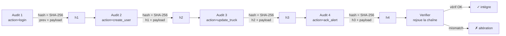

**Vérification d'intégrité :**

```python
def verify_audit_chain(logs: list[AuditLog]) -> bool:
    """Vérifie que la chaîne d'audit n'a pas été modifiée"""
    previous_hash = "0" * 64  # Genesis
    
    for log in logs:
        # Recalculer le hash
        log_data = {
            "timestamp": log.timestamp.isoformat(),
            "event_type": log.event_type,
            "actor": log.actor.to_dict(),
            "resource": log.resource.to_dict(),
            "action": log.action,
            "previous_hash": previous_hash
        }
        calculated_hash = sha256(json.dumps(log_data, sort_keys=True)).hexdigest()
        
        if calculated_hash != log.current_hash:
            alert_security("Audit log chain integrity violation", log.id)
            return False
        
        previous_hash = log.current_hash
    
    return True
```

#### 18.4.4 Collecte et stockage des logs

```
┌──────────────────────────────────────────────────────────────┐
│              Audit Logging Pipeline                           │
│                                                               │
│  [Services]  ──►  [Filebeat]  ──►  [Logstash]  ──►  [ES]    │
│       │                                              │        │
│       │                                              ▼        │
│       │                                       [Kibana]       │
│       │                                       (recherche)    │
│       │                                                     │
│       └──────────►  [PostgreSQL audit_logs]  ◄────────────── │
│                              │                                │
│                              ▼                                │
│                       [WORM storage]                          │
│                  (Write Once Read Many)                       │
│                  Conformité ADR/CEMAC                        │
│                                                               │
└──────────────────────────────────────────────────────────────┘
```

**Stockage WORM** : utilisation d'un bucket S3 avec Object Lock activé pour garantir l'immuabilité des logs sur 10 ans (conformité réglementaire).

#### 18.4.5 Détection d'anomalies de sécurité

```python
# Détection de comportements suspects
class SecurityAnomalyDetector:
    def analyze(self, recent_events: list[AuditEvent]) -> list[SecurityAlert]:
        alerts = []
        
        # 1. Tentatives de connexion multiples échouées
        failed_logins = group_by(
            filter(recent_events, e => e.event_type == "user.login.failed"),
            key="actor.ip_address"
        )
        for ip, attempts in failed_logins.items():
            if len(attempts) > 10 in 5 minutes:
                alerts.append(SecurityAlert(
                    type="brute_force",
                    source=ip,
                    severity="critical",
                    message=f"{len(attempts)} failed logins from {ip}"
                ))
        
        # 2. Accès à des ressources hors périmètre
        for event in recent_events:
            if event.event_type == "data.access" and event.result == "denied":
                # Pattern d'escalade de privilèges
                ...
        
        # 3. Modifications massives de configuration
        config_changes = filter(recent_events, e => 
            e.event_type == "config.update" and 
            e.actor.role not in ["super_admin", "csph_admin"]
        )
        if len(config_changes) > 0:
            alerts.append(SecurityAlert(
                type="unauthorized_config_change",
                severity="critical"
            ))
        
        return alerts
```

#### 18.4.6 Rapports d'audit

| Rapport | Fréquence | Destinataires | Contenu |
|---------|-----------|---------------|---------|
| **Rapport d'activité** | Mensuel | CSPH admin, DTI | Nb connexions, actions, alertes |
| **Rapport d'incidents de sécurité** | À chaque incident | CSPH admin, DTI, MINEE | Détail + réponse |
| **Rapport d'accès aux données sensibles** | Trimestriel | CSPH | Qui a accédé à quoi |
| **Rapport de conformité** | Annuel | Auditeurs externes | Conformité RGPD, ADR, CEMAC |

### 18.5 Reprise après sinistre (DR)

> **Diagramme associé :** [kubernetes-topology.eraser](../diagrams/eraser/kubernetes-topology.eraser) (3 zones A/B/C)
>
> **Réf. :** §16.6 (RPO/RTO), §18.6 (observabilité SRE)

Le SLA cible de 99,5 % impose un plan de reprise après sinistre testé semestriellement. L'architecture est **multi-zones** (3 zones Cloud CSPH : A primaire, B secondaire, C tertiaire).

#### 18.5.1 Classification des sinistres

| Niveau | Type d'incident | Impact | RTO cible | RPO cible |
|--------|-----------------|--------|-----------|-----------|
| **N1 - Mineur** | Pod crash, micro-coupure réseau | Aucun (auto-healing K8s) | < 30 s | 0 |
| **N2 - Majeur** | Perte d'un nœud EMQX, panne PostgreSQL primaire | Rétabli automatiquement | < 5 min | < 5 s |
| **N3 - Critique** | Perte d'une zone complète (A) | Bascule vers zone B | < 1 h | < 15 min |
| **N4 - Catastrophique** | Perte de 2 zones (A + B), incident datacenter | Bascule zone C + restauration S3 cross-region | < 4 h | < 24 h |
| **N5 - Black swan** | Compromission sécurité, ransomware | Reconstruction complète depuis sources saines | < 24 h | < 48 h |

#### 18.5.2 Stratégie multi-zones

| Composant | Stratégie | Mécanisme |
|-----------|-----------|-----------|
| **EMQX cluster** | Actif-actif 3 zones (Raft) | Bascule auto, clients reconnect |
| **Backend services** | Actif-actif 3 zones (Deployment K8s) | Load balancer anycast, bascule auto |
| **PostgreSQL** | Actif-passif zone A → replica B + replica C | Patroni auto-failover < 30 s |
| **TimescaleDB** | Actif-passif A → replicas B + C | Streaming replication, promotion manuelle possible |
| **Redis** | Master A → replicas B + C | Sentinel, promotion auto |
| **Kafka** | RF=3 sur 3 zones | Perte 1 broker = aucune perte |
| **MinIO S3** | Erasure coding cross-zone | Données toujours disponibles |

#### 18.5.3 Procédure de bascule N3 (perte zone A)

```bash
# 1. Détection automatique (Prometheus alert: zone_a_down > 2 min)
#    → déclencher runbook DR-N3

# 2. Promotion PostgreSQL replica B
patronictl -c /etc/patroni.yml failover --master pg-primary-a --candidate pg-replica-b

# 3. Bascule HAProxy (DNS update ou Consul)
consul-cli kv put service/postgres/leader pg-replica-b

# 4. Resync Kafka (MirrorMaker 2 se reconnecte automatiquement)

# 5. Vérification health globale
./scripts/health-check-all-zones.sh

# 6. Notification CSPH
./scripts/notify-csph.sh "DR activé, ETA rétablissement: 15 min"
```

#### 18.5.4 Procédure de bascule N4 (perte 2 zones)

```bash
# 1. Activation zone C (autre région cloud)
kubectl --context zone-c scale deployment --all --replicas=3

# 2. Restauration PostgreSQL depuis S3 cross-region
wal-g backup-fetch /var/lib/postgresql/15/main LATEST
systemctl start postgresql

# 3. Reconstruction Redis depuis RDB S3
cp s3://cspH-backups/redis/latest.rdb /var/lib/redis/dump.rdb
systemctl start redis

# 4. Notification CSPH + forces de l'ordre si incident sécurité
./scripts/notify-csph.sh --severity critical "DR-N4 activé"
```

#### 18.5.5 Tests (Game Day)

Trimestriellement, exécution d'un **Game Day** simulant chaque niveau :

| Test | Scénario | Outil | Fréquence |
|------|----------|-------|-----------|
| **Chaos pod** | Kill random pod | Chaos Monkey / Litmus | Continu (prod) |
| **Chaos node** | Drain d'un nœud K8s | `kubectl drain` | Mensuel |
| **Chaos zone** | Blackout zone A (simulé) | Runbook + Terraform | Trimestriel |
| **Backup restore** | Restaurer backup sur env test | `wal-g` + scripts | Mensuel |
| **Failover DB** | Bascule PostgreSQL | `patronictl failover` | Mensuel |
| **DR complet** | Bascule N3 simulée | Runbook complet | Semestriel |
| **Black swan** | Compromission sécurité simulée | Tabletop exercise | Annuel |

#### 18.5.6 Documentation et communication

| Document | Responsable | Fréquence MAJ |
|----------|-------------|---------------|
| Plan de continuité d'activité (PCA) | Lead SRE | Annuelle + après chaque incident |
| Runbooks par scénario | Cellule SRE | À chaque évolution infra |
| Annuaire de garde | DevOps | Continu |
| Communication CSPH | Lead projet | À chaque activation |

### 18.6 Observabilité & SRE

> **Skill liée :** `dashboard-design` (`.opencode/skills/dashboard-design/`)
>
> **Réf. :** §15.5 (mitigations SLA), §18.5 (DR)

L'observabilité suit le modèle **RED** (Rate, Errors, Duration) pour les services et **USE** (Utilization, Saturation, Errors) pour les ressources, enrichi par le tracing distribué.

#### 18.6.1 Stack d'observabilité

| Couche | Outil | Usage | Retention |
|--------|-------|-------|-----------|
| **Métriques** | Prometheus + Grafana | RPS, latence, CPU, RAM, custom | 13 mois (réglementaire) |
| **Tracing** | OpenTelemetry + Jaeger | Latence inter-services | 30 jours hot, 1 an cold |
| **Logs** | Loki + Promtail | Logs structurés JSON | 13 mois |
| **Profiling** | Pyroscope (continuous) | Flame graphs CPU/RAM | 7 jours |
| **Alerting** | Alertmanager + PagerDuty | Alertes critiques | N/A |
| **SLO tracking** | Sloth + Prometheus | Error budget, burn rate | 13 mois |
| **Synthetic** | Blackbox Exporter | Probes MQTT, HTTPS, PostgreSQL | 1 an |
| **Real User Monitoring** | OpenTelemetry Browser SDK | Latence dashboard perçue | 90 jours |

#### 18.6.2 SLO (Service Level Objectives)

| Service | SLO disponibilité | SLO latence p99 | Error budget mensuel |
|---------|-------------------|------------------|---------------------|
| **Ingestion camions** | 99.95 % | < 200 ms | 21 min |
| **Ingestion bouteilles** | 99.9 % | < 200 ms | 43 min |
| **Tracking live** | 99.5 % | < 1 s | 3 h 36 min |
| **Dashboard** | 99.5 % | < 2 s | 3 h 36 min |
| **API rapports** | 99.0 % | < 5 s | 7 h 18 min |
| **Alertes** | 99.99 % | < 30 s | 4 min |
| **Auth** | 99.99 % | < 100 ms | 4 min |

#### 18.6.3 Alerting par burn rate

**Fenêtre multi-burn rate** (méthode Google SRE Workbook) :

```yaml
# Alert: error_budget_burn_fast
# Page on-call immédiatement
- alert: ErrorBudgetBurnFast
  expr: |
    (
      sum(rate(http_requests_total{status=~"5.."}[5m]))
      /
      sum(rate(http_requests_total[5m]))
    ) > (14.4 * 0.001)  # 14.4× burn rate pour 1% budget en 1h
  for: 2m
  labels:
    severity: critical
  annotations:
    summary: "Error budget burning 14× faster than sustainable"
    runbook: "https://wiki.cspH/runbooks/error-budget-burn"

# Alert: error_budget_burn_slow
# Ticket pendant les heures ouvrées
- alert: ErrorBudgetBurnSlow
  expr: |
    (
      sum(rate(http_requests_total{status=~"5.."}}[1h]))
      /
      sum(rate(http_requests_total[1h]))
    ) > (6 * 0.001)  # 6× burn rate pour 5% budget en 24h
  for: 15m
  labels:
    severity: warning
```

#### 18.6.4 Runbooks par service

Chaque service critique doit avoir un runbook dans `docs/runbooks/` :

| Service | Runbook |
|---------|---------|
| EMQX | `emqx-cluster-down.md`, `emqx-high-latency.md`, `emqx-queue-growing.md` |
| PostgreSQL | `pg-replication-lag.md`, `pg-connection-pool-exhausted.md`, `pg-disk-full.md` |
| TimescaleDB | `ts-chunk-corruption.md`, `ts-query-slow.md`, `ts-disk-full.md` |
| Kafka | `kafka-under-replicated.md`, `kafka-consumer-lag.md`, `kafka-broker-down.md` |
| svc-ingestion-camions | `ingestion-high-error-rate.md`, `ingestion-kafka-down.md` |
| svc-alertes | `alertes-false-positive-storm.md`, `alertes-sms-provider-down.md` |

#### 18.6.5 On-call et escalade

| Niveau | Personne | Délai réponse | Délai résolution cible |
|--------|----------|---------------|------------------------|
| **L1 - Primary on-call** | Dev/SRE rotation | < 15 min | < 1 h |
| **L2 - Secondary on-call** | Architecte/Senior | < 30 min | < 4 h |
| **L3 - Manager** | Lead projet | < 1 h | < 24 h |
| **L4 - CSPH** | Référent CSPH | < 4 h | < 72 h |

**Rotation** : 1 semaine, 4 personnes, payouts week-end majorés.

#### 18.6.6 Post-mortem et culture blameless

À chaque incident S1/S2 :

1. **Post-mortem** dans les 5 jours ouvrés
2. Format blameless (pas de personne désignée)
3. Timeline factuelle + causes racines + actions correctives
4. Actions assignées avec deadline et owner
5. Publié en interne + partagé avec CSPH si impact métier
6. Suivi des actions à 30/60/90 jours

**Template** : `docs/postmortems/YYYY-MM-DD-<incident>.md`

#### 18.6.7 SLO reviews

**Fréquence** : mensuelle (revue SRE + CSPH).

**Métriques** :
- Disponibilité réelle vs cible
- Latence p99 vs cible
- Burn rate error budget
- Incidents par SLO
- Actions post-mortem en cours

### 18.7 Mise à jour OTA firmware ADAM-6717

> **Skill liée :** `iot-development` (`.opencode/skills/iot-development/`)
>
> **Réf. :** §13 (HLD), §18.1 (sécurité mTLS)

La mise à jour OTA (Over-The-Air) du firmware ADAM-6717 est une opération **critique** car elle concerne 500+ devices en production, sur des sites distants au Cameroun, avec des coupures réseau 4G fréquentes.

#### 18.7.1 Architecture OTA

```
┌──────────────────────────────────────────────────────────────┐
│                    Architecture OTA                           │
├──────────────────────────────────────────────────────────────┤
│                                                               │
│  Git Repo (firmware)                                          │
│       ↓                                                       │
│  CI GitHub Actions (build + sign + SBOM)                      │
│       ↓                                                       │
│  MinIO S3 (firmware-ota/<version>/)                          │
│       ↓ (URL signée, validée 1h)                             │
│  svc-fleet-mgmt (Bun)                                         │
│       ↓                                                       │
│  EMQX topic: csph/fleet/ota/announce                         │
│       ↓                                                       │
│  ADAM-6717 (téléchargement + vérif + installation)           │
│       ↓                                                       │
│  EMQX topic: csph/fleet/ota/status                           │
│       ↓                                                       │
│  svc-fleet-mgmt (collecte statuts, dashboard)                │
│                                                               │
└──────────────────────────────────────────────────────────────┘
```

#### 18.7.2 Cycle de release firmware

| Étape | Description | Durée |
|-------|-------------|-------|
| 1. Développement | Branche `feat/fw-X.Y.Z` | Variable |
| 2. Tests unitaires + intégration | GitHub Actions | 30 min |
| 3. Tests hardware (lab) | 10 ADAM-6717 en lab | 48 h |
| 4. Tests terrain (canary) | 5 camions en exploitation réelle | 7 jours |
| 5. Signature + SBOM | Cosign + Syft | 5 min |
| 6. Publication OTA | Push vers S3 + annonce | 10 min |
| 7. Rollout progressif | 5% → 25% → 50% → 100% | 14 jours |
| 8. Monitoring post-rollout | Taux succès, métriques | 14 jours |

#### 18.7.3 Sécurité de la mise à jour

| Mesure | Implémentation |
|--------|----------------|
| **Signature cryptographique** | Cosign (Sigstore) + clé privée HSM |
| **Vérification côté device** | Clé publique cosign embarquée dans firmware de base (root of trust) |
| **Chiffrement en transit** | HTTPS vers S3 avec URL signée |
| **Anti-replay** | Numéro de version monotone, timestamp signé |
| **Rollback** | Partition A/B (dual firmware), retour auto si boot échec |
| **Audit** | Chaque mise à jour loggée avec hash, signataire, devices affectés |

#### 18.7.4 Stratégie de rollout

**Staged rollout** avec fenêtres de maintenance :

```typescript
// Configuration rollout (svc-fleet-mgmt)
interface RolloutConfig {
  firmware_version: string;
  target_groups: RolloutGroup[];
  start_at: Date;
  end_at: Date;
  max_failure_rate: number;  // 0.05 = 5%
  auto_rollback: boolean;
  maintenance_window: {
    day_of_week: number;  // 1 = lundi
    start_hour: number;   // 2 = 2h du matin WAT
    end_hour: number;
  };
}

const rollout_1_5_0: RolloutConfig = {
  firmware_version: '1.5.0',
  target_groups: [
    { name: 'canary',    percentage: 5,  filter: { truck_age_days: { lt: 90 } } },
    { name: 'pilot',     percentage: 25, depends_on: 'canary',    min_success_rate: 0.97 },
    { name: 'majority',  percentage: 50, depends_on: 'pilot',     min_success_rate: 0.97 },
    { name: 'general',   percentage: 100, depends_on: 'majority', min_success_rate: 0.97 }
  ],
  start_at: '2026-07-15T01:00:00Z',
  end_at:   '2026-08-15T01:00:00Z',
  max_failure_rate: 0.05,
  auto_rollback: true,
  maintenance_window: { day_of_week: 1, start_hour: 2, end_hour: 5 }
};
```

#### 18.7.5 Rollback automatique

Conditions de rollback automatique :

- Taux d'échec d'installation > 5 % sur une cohorte
- Taux de devices offline > 30 % dans les 24 h post-update
- Crash répété du firmware (boot failure > 3 fois)
- Régression de performance > 20 % (latence MQTT, etc.)

Mécanisme : partition B restaurée, device reboote sur firmware N-1, alerte SRE.

#### 18.7.6 Communication avec chauffeurs

| Étape | Canal | Contenu | Délai |
|-------|-------|---------|-------|
| Annonce J-7 | SMS + email | "Mise à jour prévue, ne pas couper le contact" | 7 jours |
| Rappel J-1 | SMS | "Mise à jour demain entre 2h et 5h" | 24 h |
| Démarrage | SMS | "Mise à jour en cours, ~5 min d'interruption" | 0 |
| Succès | SMS | "Mise à jour réussie, version X.Y.Z" | +5 min |
| Échec | SMS + appel | "Mise à jour échouée, contactez support" | +10 min |

#### 18.7.7 KPIs OTA

| KPI | Cible | Mesure |
|-----|-------|--------|
| Taux de succès d'installation | > 98 % | Sur tous les rollouts |
| Temps moyen d'installation | < 5 min | ADAM-6717 download + flash + reboot |
| Rollback rate | < 2 % | Sur tous les rollouts |
| Devices à jour | > 95 % | Dans les 30 jours post-release |
| Vulnérabilités connues (CVE) | < 7 jours | Délai de patch après divulgation |

---

## Conclusion de la Partie VI

Cette conception du système couvre l'ensemble des dimensions techniques nécessaires à la mise en œuvre du système de traçabilité CSPH :

✅ **Architecture HLD** : 5 couches séparées (terrain, transport, traitement, données, présentation) avec des principes clairs de scalabilité, résilience et sécurité

✅ **Broker MQTT** : EMQX retenu pour ses capacités enterprise, configuration des topics documentée, clustering HA

✅ **Backend & microservices** : architecture événementielle avec Kafka, 9 services métier clairement délimités, load balancing HAProxy, performances validées (Bun-tuned, §15.5)

✅ **Bases de données** : TimescaleDB pour le time-series, PostgreSQL pour le métier, Redis pour le cache — chacun avec son rôle et ses performances attendues, stratégie backup/RPO/RTO formalisée (§16.6)

✅ **Dashboard & reporting** : stack React/Next.js moderne, 17 rapports métier, détection de fraude avancée (RBAC + ML), géofencing (§17.5), détection de vol de cargaison (§17.6)

✅ **Sécurité** : PKI X.509 complète, RBAC granulaire, chiffrement bout-en-bout, audit trail immuable, DR multi-zones (§18.5), observabilité SRE (§18.6), mise à jour OTA firmware sécurisée (§18.7)

### Annexes

- **Diagrammes Mermaid** (rendus inline dans ce document) : 15 schémas intégrés dans les sections correspondantes
- **Diagrammes eraser.io** (techniques) : [`docs/diagrams/eraser/`](../diagrams/eraser/) — 4 schémas avec documentation markdown
  - [Architecture Cloud 5 couches](../diagrams/eraser/architecture-cloud.md)
  - [Topologie Kubernetes 3 zones](../diagrams/eraser/kubernetes-topology.md)
  - [Périmètre sécurité ATEX/ADR/mTLS](../diagrams/eraser/security-zones.md)
  - [Architecture réseau VPC](../diagrams/eraser/network.md)

### ADR référencés

- [ADR-0001 — Adopter Bun comme runtime backend](../adr/0001-use-bun-runtime.md)
- [ADR-0002 — Stratégie hybride Mermaid + eraser.io](../adr/0002-hybrid-diagrams-mermaid-eraser.md)
- [ADR-0003 — Workflow Git (Gitflow + Conventional Commits)](../adr/0003-gitflow-conventional-commits.md)

### Vers la Partie VII

Les fondations techniques sont établies. La **Partie VII** (à venir) abordera :
- Dimensionnement détaillé (compute, stockage, bande passante)
- Planning de mise en œuvre (planning Gantt, jalons)
- Chiffrage (TCO, ROI, plan d'investissement)

Pour créer une nouvelle PARTIE, suivre [`docs/parties/CONVENTIONS.md`](../parties/CONVENTIONS.md).
