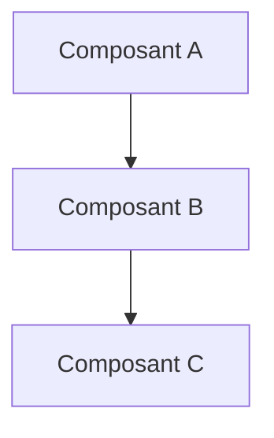

# PARTIE [N] — [Titre]

> **Voir :** [00-INDEX](../00-INDEX.md) · [ADR liés](../adr/) · [Diagrammes](../diagrams/INDEX.md) · [PARTIE_VI](</chemin/relatif/PARTIE_VI.md>)

## Résumé exécutif

> 3-5 phrases. Quelle problématique ? Quelle solution ? Quel impact attendu ?

## Table des matières

- [1. Contexte et objectifs](#1-contexte-et-objectifs)
- [2. Architecture / Conception](#2-architecture--conception)
- [3. Justification des choix](#3-justification-des-choix)
- [4. Implémentation](#4-implémentation)
- [5. Validation et tests](#5-validation-et-tests)
- [6. Risques et mitigations](#6-risques-et-mitigations)
- [7. Conclusion et suites](#7-conclusion-et-suites)

---

## 1. Contexte et objectifs

### 1.1 Problématique

Quelle question cette PARTIE adresse-t-elle ? Quel est le besoin métier ou technique ?

### 1.2 Objectifs mesurables

| Objectif | Métrique | Cible |
|----------|----------|-------|
| Ex. Latence ingestion | p99 | < 50ms |
| Ex. Disponibilité | SLA | 99,5% |
| Ex. Couverture tests | % | > 80% |

### 1.3 Hors-scope

Ce que cette PARTIE **ne couvre pas** (et où c'est traité le cas échéant).

---

## 2. Architecture / Conception

> Insérer ici des diagrammes (Mermaid inline ou lien vers [`diagrams/eraser/`](../diagrams/eraser/)).

### 2.1 Vue d'ensemble

> Référence : [`docs/diagrams/INDEX.md`](../diagrams/INDEX.md) pour le critère de choix Mermaid vs eraser.io.

### 2.2 Composants détaillés

#### Composant X

**Rôle** : ...

**Interfaces** :
- Entrée : ...
- Sortie : ...

**Dépendances** : ...

---

## 3. Justification des choix

> Pour chaque décision structurante, créer un ADR dans `docs/adr/`.

| Décision | Alternative écartée | Justification | ADR |
|----------|--------------------|--------------| -----|
| Choix A | Choix B | Raison | [ADR-XXXX](../adr/XXXX-*.md) |

---

## 4. Implémentation

### 4.1 Prérequis

- [ ] ...
- [ ] ...

### 4.2 Étapes de déploiement

1. ...
2. ...
3. ...

### 4.3 Configuration

| Paramètre | Valeur par défaut | Obligatoire |
|-----------|------------------|-------------|
| Ex. `MQTT_BROKER_URL` | `mqtts://broker.local:8883` | Oui |

---

## 5. Validation et tests

| Type de test | Cible | Outil |
|--------------|-------|-------|
| Unitaire | > 80% coverage | bun test |
| Intégration | 100% endpoints critiques | vitest |
| Charge | 5k msg/s pendant 1h | k6 |
| Sécurité | Scan CVE + pen test | OWASP ZAP |

---

## 6. Risques et mitigations

| Risque | Probabilité | Impact | Mitigation |
|--------|-------------|--------|------------|
| Ex. Saturation MQTT | Moyenne | Élevé | Auto-scaling EMQX + alertes |
| Ex. Fuite données | Faible | Critique | Chiffrement + audit + monitoring |

---

## 7. Conclusion et suites

### Ce qui a été livré

- [ ] ...

### Limitations connues

- ...

### Suites (futures PARTIES / ADR)

- [ ] PARTIE VIII : ...
- [ ] ADR-XXXX : ...

---

> **Voir aussi :** [00-INDEX](../00-INDEX.md) · [PARTIE_VI](</chemin/relatif/PARTIE_VI.md>) · [Diagrammes](../diagrams/INDEX.md) · [ADR liés](../adr/)
>
> **Auteurs :** [Prénom Nom] · **Validation :** _à signer après revue_
